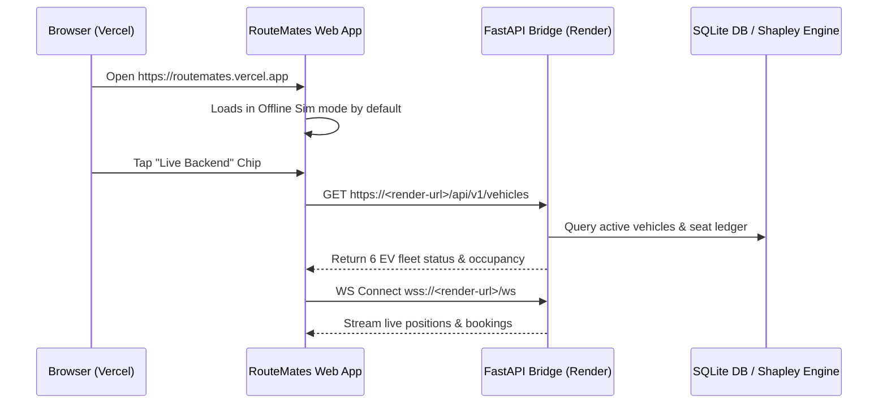

# RouteMates Deployment Guide

This guide details how to deploy **RouteMates** to production:
* **Backend:** Python FastAPI deployed on **Render**
* **Frontend:** Flutter Web deployed on **Vercel**

---

## Part 1: Deploy Backend to Render

You can deploy the backend using either **Render Blueprints** (recommended, 1-click) or as a **Manual Web Service**.

### Option A: Render Blueprint (Recommended)
1. Push your repository to GitHub.
2. Go to the [Render Dashboard](https://dashboard.render.com/) and click **New +** → **Blueprint**.
3. Connect your GitHub repository.
4. Render will automatically detect [render.yaml](file:///c:/Users/Naren/Downloads/ABHIAPP/render.yaml) and configure:
   * **Service Name:** `routemates-backend`
   * **Root Directory:** `backend`
   * **Build Command:** `pip install -r requirements.txt`
   * **Start Command:** `uvicorn app.main:app --host 0.0.0.0 --port $PORT`
   * **Health Check:** `/health`
5. Click **Apply**.
6. Once deployed, note down your live service URL (e.g., `https://routemates-backend.onrender.com`).

### Option B: Manual Web Service
If setting up manually without Blueprint:
* **Service Type:** Web Service
* **Runtime:** Python (or Docker using `backend/Dockerfile`)
* **Root Directory:** `backend`
* **Build Command:** `pip install -r requirements.txt`
* **Start Command:** `uvicorn app.main:app --host 0.0.0.0 --port $PORT`
* **Environment Variables:**
  * `PYTHON_VERSION`: `3.11.9`
  * `DEMO_MODE`: `true`
  * `DATABASE_PATH`: `ridepool.db`
  * `JWT_SECRET`: *(A secure random string)*

### Verify Backend Deployment
Visit your Render URL:
* Health Endpoint: `https://<YOUR_RENDER_URL>/health`
* Interactive API Docs: `https://<YOUR_RENDER_URL>/docs`
* WebSocket Hub: `wss://<YOUR_RENDER_URL>/ws`

---

## Part 2: Deploy Flutter Web to Vercel

The repository includes both root-level and `mobile/`-level configurations for seamless Vercel integration.

### Method 1: Root Repository Deployment
1. Go to your [Vercel Dashboard](https://vercel.com/) and click **Add New...** → **Project**.
2. Import your GitHub repository.
3. Configure the project:
   * **Framework Preset:** Other
   * **Root Directory:** `./` (default)
   * **Build Command:** (configured in `vercel.json` as `bash build.sh`)
   * **Output Directory:** `mobile/build/web`
4. **Environment Variables:**
   * Add `BACKEND_URL`: `https://<YOUR_RENDER_URL>` (e.g. `https://routemates-backend.onrender.com`)
5. Click **Deploy**.

Vercel will run `build.sh`, download the Flutter SDK, enable web support, compile the production bundle with your `BACKEND_URL` injected, and deploy the application.

---

### Method 2: Subfolder (`mobile/`) Deployment
If you set the **Root Directory** in Vercel to `mobile`:
* **Build Command:** `bash vercel-build.sh`
* **Output Directory:** `build/web`
* **Environment Variables:**
  * `BACKEND_URL`: `https://<YOUR_RENDER_URL>`

---

## Part 3: Architecture & Communication

### Dynamic Backend Switching
* **Default Mode:** The app launches in zero-latency **Offline Simulation** mode for offline demonstrations and evaluator convenience.
* **Live Mode:** Tapping the **"Offline Sim"** header chip toggles to **"Live Backend"**, sending live REST and WebSocket requests to your Render URL.
* If built without `BACKEND_URL`, the live toggle falls back to `http://127.0.0.1:8000` for local pair programming.

---

## Part 4: Pre-deployment Checklist

- [x] Run static analysis: `dart analyze` (0 issues)
- [x] Run mobile test suite: `flutter test` (240 tests pass)
- [x] Run backend test suite: `python -m pytest tests/ -v` (10 tests pass)
- [x] Test production web build: `flutter build web --release` (Generates `mobile/build/web`)
