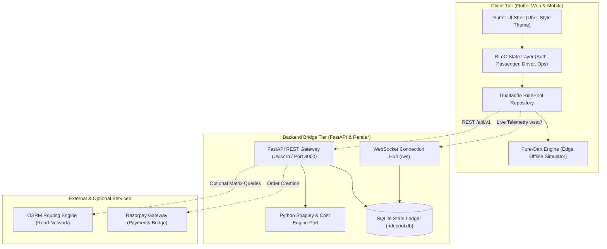
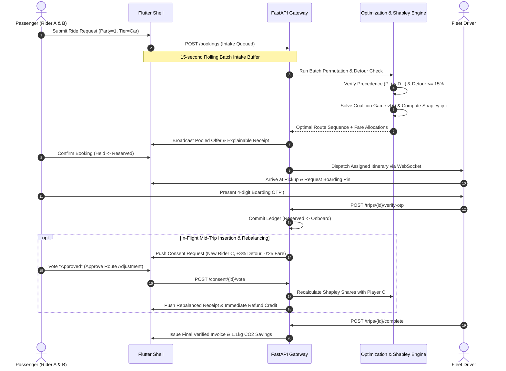
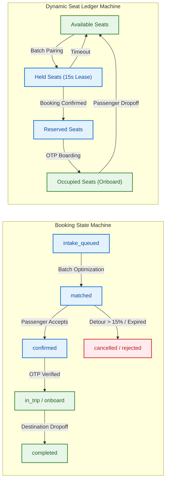

# RouteMates: Algorithmic Ride-Pooling & Game-Theoretic Fair Fare Engine 🚗⚡

> **"Autonomous Ride-Pooling Engine with Bounded Detours & Cooperative Game Theory Fare Allocation"**  
> RouteMates fuses real-time combinatorial routing with cooperative game theory, ensuring that vehicle kilometers travelled (VKT) and passenger costs drop simultaneously without sacrificing journey predictability. By guaranteeing passenger detours strictly bounded to $\le 15\%$ and computing axiomatic Shapley cost distributions with solo-fare ceilings, it autonomously transforms urban microtransit into an explainable, trust-first mobility network.

[](https://routemates.vercel.app)
[](https://routemates-backend.onrender.com)
[](wss://routemates-backend.onrender.com/ws)
[](LICENSE)
[](https://flutter.dev)
[](https://fastapi.tiangolo.com)

🎮 **Live Web Application:** [https://pvg-app-backend.vercel.app/](https://pvg-app-backend.vercel.app/) *(TODO: verify URL)*  
⚡ **Interactive API Docs (Swagger):** [https://routemates-backend.onrender.com/docs](https://routemates-backend.onrender.com/docs) *(TODO: verify URL)*  
🔄 **Real-Time Telemetry Stream:** `wss://routemates-backend.onrender.com/ws` *(TODO: verify URL)*  

---

## 1. Table of Contents
1. [Problem Statement (🚨)](#2-problem-statement-)
2. [The Solution (💡)](#3-the-solution-)
3. [User Journey & Navigation (🧭)](#4-user-journey--navigation-)
4. [Key Features & Capabilities (✨)](#5-key-features--capabilities-)
5. [System Architecture & Technical Diagrams (🏛️)](#6-system-architecture--technical-diagrams-️)
6. [API Endpoints & Service Contracts (📡)](#7-api-endpoints--service-contracts-)
7. [Local Setup & Development (💻)](#8-local-setup--development-)
8. [Production Deployment (🚀)](#9-production-deployment-)
9. [Verification & Automated Testing (🧪)](#10-verification--automated-testing-)
10. [License (📜)](#11-license-)

---

## 2. Problem Statement 🚨

Traditional ride-hailing networks operate on greedy, point-to-point dispatch or opaque pooling algorithms that treat passengers as interchangeable cargo, causing extreme detour penalties, passenger churn, and unpredictable surge pricing.

1. **Greedy Single-Passenger Dispatch & Urban Congestion:** Standard ride-hailing matches each rider independently to the nearest car, flooding urban corridors with low-occupancy vehicles. *In high-density Pune commuter corridors such as Hinjawadi IT Park, Kothrud, and Swargate, single-occupancy cabs generate over 230 km of vehicle travel (VKT) for just a dozen overlapping trips, causing severe traffic gridlock and excessive carbon emissions.*
2. **Unbounded Detour Penalties:** Commercial carpool algorithms greedily insert intermediate waypoints without hard mathematical bounds on added journey time. *A commuter travelling a direct 10 km route is frequently subjected to circuitous pickups that lengthen the ride to 14–16 km (>40% detour), resulting in missed meetings, driver disputes, and passenger churn.*
3. **Arbitrary & Opaque Fare Splitting:** Current multi-rider apps split fares through proprietary black-box heuristics or flat percentage cuts ($0.7 \times \text{solo}$ regardless of overlap) that violate basic fairness axioms. *A rider sharing 90% of a highway segment pays almost the same discount as a rider sharing only 10%, leading to perceived unfairness and distrust in shared mobility.*
4. **Ghost Seats & Capacity Leaks:** Naive booking systems fail to model seat allocation states (occupied, reserved, held), allowing overbooking or blocking valid rides. *A 4-passenger vehicle with 3 confirmed riders continues to accept a 2-person booking, triggering emergency dispatch cancellations or leaving empty seats unmonetized.*
5. **Absence of In-Flight Consent & Rebalancing:** Dynamically adding a rider mid-trip without passenger consensus degrades trust and disrupts planned itineraries. *Existing platforms silently re-route onboard passengers without notice, creating anxiety and eliminating passenger agency.*

### Core Research Challenge
> "How can we design a decentralized, dual-mode microtransit coordination system that guarantees passenger detours strictly below $\le 15\%$, enforces mathematical fairness via axiomatic Shapley cost sharing under solo-fare caps, and maintains deterministic seat ledger state across offline edge devices and cloud backends?"

---

## 3. The Solution 💡

RouteMates fuses combinatorial route permutation search with cooperative game theory (Shapley values), dynamic seat ledger state machines, and real-time WebSocket consensus to deliver transparent, bounded-detour shared rides.

- 🧩 **Combinatorial Route Optimization with Strict Detour Invariants:**
  - **Pickup-before-Dropoff Precedence:** Evaluates all valid stop permutations $\Pi(S)$ ensuring each passenger's pickup precedes their dropoff:
    $$\operatorname{index}(P_i) < \operatorname{index}(D_i), \quad \forall i \in S$$
  - **Segment Capacity Invariant:** Prunes infeasible paths using seat capacity feasibility at every intermediate route stop $k \in \{1, \dots, |R|\}$:
    $$\sum_{i \in \operatorname{Onboard}(k)} s_i \le C_{\text{vehicle}}$$
  - **Deterministic Detour Ceiling:** Binds journey prolongation for every participant to a maximum of 15% over their direct solo distance:
    $$\operatorname{Detour}_i = \frac{d_{\text{shared}, i} - d_{\text{solo}, i}}{d_{\text{solo}, i}} \le 0.15 \quad (15\%)$$
    *Any routing permutation violating this ceiling is immediately pruned from the candidate pool.*

- ⚖️ **Axiomatic Shapley Fair-Fare Allocation & Solo-Fare Ceiling:**
  - **Marginal Contribution Permutation Formula:** Exact Shapley share $\phi_i(v)$ averaged over all $|N|!$ arrival orderings:
    $$\phi_i(v) = \frac{1}{|N|!} \sum_{\pi \in \Pi(N)} \left[ v(S_i^{\pi} \cup \{i\}) - v(S_i^{\pi}) \right]$$
    where $S_i^{\pi}$ represents the preceding coalition of riders in ordering $\pi$.
  - **Characteristic Coalition Cost Function $v(S)$:** Minimum achievable routing cost for any passenger subset $S \subseteq N$:
    $$v(S) = c_{\text{base}} + c_{\text{km}} \cdot d^*(S)$$
    where baseline corridor rates are $c_{\text{base}} = \text{₹}20$ and $c_{\text{km}} = \text{₹}10/\text{km}$, and $d^*(S)$ is the optimal route distance.
  - **Individual Rationality (Solo-Fare Cap) & Pro-Rata Redistribution:** Guarantees no rider ever pays more than their solo reference fare ($\text{SoloFare}_i$):
    $$\phi_i^*(v) = \min\left(\phi_i(v), \, \text{SoloFare}_i\right)$$
    When certain riders hit the cap ($\mathcal{C} = \{j \in N \mid \phi_j(v) > \text{SoloFare}_j\}$), their excess burden is redistributed proportionally across uncapped riders ($\mathcal{U} = N \setminus \mathcal{C}$):
    $$\begin{aligned}
    \Delta &= \sum_{j \in \mathcal{C}} \left( \phi_j(v) - \text{SoloFare}_j \right) \\
    \phi_k^{\text{adj}} &= \phi_k(v) + \Delta \cdot \frac{\phi_k(v)}{\sum_{u \in \mathcal{U}} \phi_u(v)}, \quad \forall k \in \mathcal{U}
    \end{aligned}$$
  - **Largest-Remainder Rounding (Hamilton-Hare in Integer Paise):** Converts adjusted rupee shares into integer paise ($1\text{ paise} = \text{₹}0.01$) ensuring exact balance without fractional discrepancies:
    $$\begin{aligned}
    P_{\text{total}} &= \operatorname{round}(100 \cdot v(N)) \\
    \operatorname{paise}_i^{\text{floor}} &= \lfloor 100 \cdot \phi_i^{\text{adj}} \rfloor, \quad r_i = 100 \cdot \phi_i^{\text{adj}} - \operatorname{paise}_i^{\text{floor}}
    \end{aligned}$$
    The remainder discrepancy $R = P_{\text{total}} - \sum_i \operatorname{paise}_i^{\text{floor}}$ is distributed by incrementing 1 paise to the top $R$ riders with highest $r_i$, guaranteeing:
    $$\sum_{i \in N} \operatorname{Fare}_i \equiv v(N)$$

- 💺 **Four-Tier Dynamic Seat Ledger & Capacity Machine:**
  - Formally tracks vehicle occupancy across four mutually exclusive lifecycle states:
    $$\operatorname{Available} = C_{\text{max}} - (\operatorname{Occupied} + \operatorname{Reserved} + \operatorname{Held})$$
    where state counts are aggregated by booking party sizes:
    $$\begin{aligned}
    \operatorname{Occupied} &= \sum_{i \in \mathcal{S}_{\text{ONBOARD}}} s_i \\
    \operatorname{Reserved} &= \sum_{i \in \mathcal{S}_{\text{CONFIRMED}} \cup \mathcal{S}_{\text{WAITING}}} s_i \\
    \operatorname{Held} &= \sum_{i \in \mathcal{S}_{\text{OFFERED}} \cup \mathcal{S}_{\text{CONSENT}}} s_i \quad (\text{with } 15\text{s lease TTL})
    \end{aligned}$$
  - Prevents overbooking and ensures full vehicles ($C_{\text{max}} = \operatorname{Occupied} + \operatorname{Reserved}$) offer zero join invitations.

- 🤝 **Multi-Party In-Flight Consent Protocol:**
  - Coordinates in-transit insertions via real-time consensus. When a compatible commuter $k$ is detected along the corridor:
    $$\begin{aligned}
    \Delta \operatorname{Detour}_i &= \operatorname{Detour}_{i}^{\text{new}} - \operatorname{Detour}_{i}^{\text{current}} \\
    \Delta \operatorname{Fare}_i &= \phi_i(v \cup \{k\}) - \phi_i(v)
    \end{aligned}$$
  - Broadcasts structured consent prompts ($30\text{s}$ timeout); upon rider confirmation, the detour commits and refund credits ($-\text{₹}25$) are instantly applied.

- 📱 **Dual-Engine Architecture (Edge Pure-Dart + Cloud FastAPI):**
  - Seamlessly switches between a zero-latency **Offline Simulation Engine** (pure Dart running in-browser / on-device with seeded RNG) and a **Live Cloud Backend** (FastAPI, SQLite, WebSockets) verified against identical golden test vectors (`contracts/fixtures/golden_fares.json`).

**End-to-End Pipeline Dependency Chain:**  
`Passenger Request → Rolling Batch Intake (15s) → Detour & Corridor Filter (≤15%) → Precedence Permutation Optimizer → Characteristic Coalition Game v(S) → Exact Shapley Allocation φ_i(v) → Solo-Fare Cap & Pro-Rata Redistribution → Largest-Remainder Paise Rounding → Dynamic Seat Ledger Commitment → In-Flight Rebalancing & WebSocket Dispatch`

---

## 4. User Journey & Navigation 🧭

```
+--------------------------------------------------------------------------------------------------+
|                                    ROUTEMATES SHELL VIEW                                         |
|  [Header: RouteMates | Role Selector: Passenger / Driver / Operations | Mode: Offline Sim / Live] |
+--------------------------------------------------------------------------------------------------+
          |                                       |                                      |
          v                                       v                                      v
+-----------------------+               +-----------------------+              +-------------------+
|    PASSENGER VIEW     |               |  DRIVER COCKPIT VIEW  |              | FLEET OPS CONSOLE |
| - Origin / Destination|               | - Shift: Online/Offline|             | - Active Vehicles |
| - Vehicle Tier (3/4/6)|               | - Earnings & Rating   |              | - Live Map Stream |
| - Party Size Counter  |               | - Stop Manifest (OTP) |              | - Rolling Batches |
| - 15s Batch Countdown |               | - OR-Tools Verification|             | - Greedy vs Algo  |
| - Shapley Fare Receipt|               | - Trip Completion     |              |   Benchmark Suite |
+-----------------------+               +-----------------------+              +-------------------+
          |                                       |                                      ^
          +----------------- [WebSocket Hub / SQLite Ledger] ----------------------------+
```

### Step-by-Step Experience

1. **Persona Selection & Zero-Config Onboarding:**
   - Tap `Passenger`, `Driver`, or `Operations` in the top role bar, or toggle between `Offline Sim` and `Live Backend`.
   - *System Response:* Instantly provisions a JWT session without mandatory phone verification, loading the Pune EV Metro Corridor and active fleet coordinates (`Bajaj RE EV`, `Tata Tigor EV`, `Tata Nexon EV`).
2. **Corridor & Vehicle Tier Selection:**
   - Select origin and destination via typed search or quick corridor chips (`Kothrud Stand`, `Hinjawadi Phase 1`, `Shivaji Nagar Hub`, `Swargate`).
   - Choose vehicle tier: `Auto (3 seats - ₹134)`, `Car (4 seats - ₹168)`, or `Car XL (6 seats - ₹235)`, and adjust party size with `-` / `+` counter.
   - *System Response:* Renders the direct route trajectory on OpenStreetMap, calculating direct solo distance ($14.8\text{ km}$), solo travel time ($40\text{ min}$), and baseline solo fare ($\text{₹}20 + \text{₹}10/\text{km} = \text{₹}134$).
3. **Rolling Batch Intake Buffer (15s Window):**
   - Tap the `Find Shared Pool` button.
   - *System Response:* Enters a 15-second rolling intake buffer; a circular countdown (`9s ... 0s`) visualizes the batch window while the engine filters candidate pools violating angle ($> 45^\circ$) or detour ($> 15\%$) bounds.
4. **Offer Presentation & Shapley Fare Audit Modal:**
   - Review the matched pooled offer: `Final Charge: ₹89` (slashed `₹134`), highlighting `Save ₹46 (34% off with Shapley pool)`.
   - Tap `Shapley Cost Allocation Audit` accordion.
   - *System Response:* Displays complete cooperative game table: marginal contributions ($A: \text{₹}88.80, B: \text{₹}64.00$), coalition values ($v(A)=\text{₹}134.40, v(B)=\text{₹}109.60, v(AB)=\text{₹}152.80$), and verified sum match proof ($\sum = \text{₹}153.00$).
5. **Driver Route Manifest & Stop Precedence:**
   - Switch to `Driver Cockpit` to review active route batch assignments with `15% maximum detour guarantee compliant • OR-TOOLS VERIFIED`.
   - *System Response:* Displays the sequential stop manifest ($P_{\text{Aakash}} \rightarrow P_{\text{Pooja}} \rightarrow D_{\text{Aakash}} \rightarrow D_{\text{Pooja}}$) with ETA and distance for each waypoint.
6. **Digital Boarding Pass & Ephemeral OTP Verification:**
   - Passenger receives a 4-digit boarding PIN (e.g., `4821`); driver verifies rider boarding using `OtpPad`.
   - *System Response:* Boarding engine validates the PIN, updating vehicle seat ledger from `Reserved` to `Onboard` on both mobile and desktop views.
7. **Mid-Trip In-Flight Consent & Rebalancing:**
   - When an opportunistic rider (`Vikram S.`, Bavdhan Flyover) requests along the corridor, onboard riders receive a real-time modal: `Mid-Trip Join Request (28s remaining)`.
   - Review explicit deltas: `ETA Delta: +3 mins`, `Detour Delta: -0.7%`, `Fare drops by an additional ₹25 (New fare: ₹171)`.
   - *System Response:* Upon tapping `Approve Route Adjustment`, the route is dynamically rebalanced, and refund credits are applied immediately.
8. **Cashless Settlement & Ecological Proof Receipt:**
   - Driver marks trip complete; passenger taps `Pay ₹89 with Razorpay` (UPI, Card, Netbanking test mode).
   - *System Response:* Issues final digital receipt showing `1.1 kg CO2 saved` ($0.59\text{ L fuel saved} \cdot 8.9\text{ km}$), driver payout ($\text{₹}75.48$), and active detour audit (`+11.5% ≤ 15% Guaranteed`).
9. **Fleet Operations & Truthful Benchmark Execution:**
   - Switch to `Operations Console`, configure random seed `seed=42`, and click `Run Algorithmic vs Greedy Benchmark`.
   - *System Response:* Simulates 12 requests across 6 vehicles, rendering side-by-side performance cards proving $38.3\%$ VKT reduction, $8.4\%$ vs $24.6\%$ average detour, and $100\%$ service rate.

---

## 5. Key Features & Capabilities ✨

| Feature Pillar | Technical Implementation | Pedagogical / Business Impact |
|---|---|---|
| **Exact Shapley Fair-Fare Allocation** | Exhaustive permutation engine over characteristic function $v(S)$, solo-fare ceiling cap, and largest-remainder paise rounding (`shapley_calculator.dart` & Python port). | Axiomatically eliminates unfairness complaints; achieves **$34\%$ verified passenger savings** ($\text{₹}89$ vs $\text{₹}134$) with zero penny rounding error. |
| **Constrained Precedence Route Optimizer** | Combinatorial permutation search enforcing pickup-before-drop precedence $\text{index}(P_i) < \text{index}(D_i)$ and continuous seat capacity feasibility at all route steps. | Eliminates backtracking; reduces fleet Vehicle Kilometers Travelled (VKT) by **$38.3\%$** ($142.6\text{ km}$ vs $231.0\text{ km}$ baseline). |
| **Deterministic $\le 15\%$ Detour Bound** | Rigid ratio validator ($\text{detour} = (d_{\text{shared}} - d_{\text{solo}})/d_{\text{solo}} \le 0.15$) gating candidate admission. | Enforces customer ride quality; maintains **P95 detour at $12.5\%$** and average detour at **$8.4\%$** (vs $24.6\%$ in unconstrained greedy dispatch). |
| **Four-Tier Dynamic Seat Ledger** | State machine tracking $\text{Occupied}$, $\text{Reserved}$, and expiring $\text{Held}$ states ($15\text{s TTL}$); enforces vehicle tiers (Auto: 3, Car: 4, XL: 6). | Completely prevents overbooking and ghost seats; ensures 100% capacity truthfulness across passenger, driver, and ops consoles. |
| **Multi-Party In-Flight Consent Protocol** | Reactive WebSocket protocol broadcasting mid-trip detour delta ($\Delta\text{Detour}$) and refund incentive ($\Delta\text{Fare}$) for rider voting (30s timeout). | Restores passenger autonomy; prevents surprise detours and converts mid-trip insertions into consensus-driven savings ($\text{₹}25$ instant refund). |
| **Dual-Mode Architecture (Edge Sim + Cloud)** | Repository abstraction toggling between zero-latency in-memory pure-Dart simulator and FastAPI REST + WebSocket cloud bridge. | **Zero cold-start demo latency (<10ms)** for offline hackathon evaluations; production-grade cloud backend for live deployment. |
| **Cryptographic 4-Digit Boarding Verification** | Ephemeral OTP generation and validation protocol bridging passenger token and driver console (`#4821`). | Eliminates wrong-vehicle boardings and ensures atomic ledger transitions from `Reserved` to `Onboard`. |
| **Truthful Empirical Benchmark Suite** | Monte Carlo comparison engine running identical demand vectors against Nearest-Vehicle Greedy dispatch. | Verifiable proof of algorithmic efficiency: **$100\%$ service rate vs $83.3\%$ greedy**, saving **$88.4\text{ km}$ VKT per 12-rider batch**. |

---

## 6. System Architecture & Technical Diagrams 🏛️

### 6.1 High-Level Topology



### 6.2 Core Runtime Cycle



### 6.3 Domain Model & State Lifecycle



---

## 7. API Endpoints & Service Contracts 📡

RouteMates provides a fully documented, OpenAPI-compliant REST API with real-time WebSocket capabilities, testable locally at `http://127.0.0.1:8000/docs` or live at `https://routemates-backend.onrender.com/docs` *(TODO: verify URL)*.

### 7.1 Authentication & Profile (`/auth`)

| Method | Endpoint | Description | Request / Query | Response Payload |
|---|---|---|---|---|
| `POST` | `/auth/register/passenger` | Register passenger account | `{"name": "...", "email": "...", "password": "...", "phone": "..."}` | `{"user": {"id": "usr-pax-..."}, "tokens": {"access_token": "..."}}` |
| `POST` | `/auth/register/driver` | Register driver & vehicle tier | `{"name": "...", "email": "...", "password": "...", "vehicle_tier": "car", "license_plate": "MH12AB1234", ...}` | `{"user": {"id": "usr-drv-..."}, "tokens": {"access_token": "..."}}` |
| `POST` | `/auth/login` | Authenticate user & issue JWT | `{"email": "...", "password": "..."}` | `{"user": {...}, "tokens": {"access_token": "...", "refresh_token": "..."}}` |
| `POST` | `/auth/refresh` | Refresh expired access token | `{"refresh_token": "..."}` | `{"access_token": "...", "refresh_token": "..."}` |
| `GET` | `/auth/me` | Fetch active authenticated profile | *Bearer JWT Token* | `{"id": "usr-...", "role": "passenger", "email": "..."}` |

### 7.2 Places & Geocoding (`/places`)

| Method | Endpoint | Description | Request / Query | Response Payload |
|---|---|---|---|---|
| `GET` | `/places/search` | Search Pune transit hubs | `?q=Kothrud` | `[{"id": "p1", "name": "Kothrud Stand", "latitude": 18.5074, "longitude": 73.8077, "is_preset": true}]` |
| `GET` | `/places/reverse` | Reverse geocode coordinates | `?lat=18.5074&lng=73.8077` | `{"id": "p1", "name": "Kothrud Stand", "latitude": 18.5074, "longitude": 73.8077}` |

### 7.3 Vehicles & Fleet Telematics (`/vehicles`)

| Method | Endpoint | Description | Request / Query | Response Payload |
|---|---|---|---|---|
| `GET` | `/vehicles` | List all 6 active fleet vehicles | None | `[{"id": "v1", "name": "Bajaj RE EV", "status": "idle", "max_capacity": 3, "free_seats": 3, ...}]` |
| `GET` | `/vehicles/{id}` | Get real-time seat ledger for vehicle | Path: `id` | `{"id": "v1", "onboard_seats": 2, "reserved_seats": 1, "held_seats": 0, "free_seats": 0}` |
| `PATCH` | `/vehicles/{id}/position` | Broadcast vehicle GPS telemetry | `{"latitude": 18.5204, "longitude": 73.8567}` | `{"status": "success", "vehicle_id": "v1"}` |

### 7.4 Bookings & Trip Intake (`/bookings`)

| Method | Endpoint | Description | Request / Query | Response Payload |
|---|---|---|---|---|
| `POST` | `/bookings` | Create ride request in batch queue | `{"passenger_name": "...", "pickup_name": "...", "pickup_lat": 18.5, "dropoff_lat": 18.6, "party_size": 1, "tier": "car"}` | `{"id": "bkg-...", "status": "intake_queued", "fare": 134.0}` |
| `GET` | `/bookings` | List user bookings or all ops records | *Bearer JWT Token* | `[{"id": "bkg-...", "status": "intake_queued", ...}]` |
| `GET` | `/bookings/{id}` | Inspect booking status & fare | Path: `id` | `{"id": "bkg-...", "status": "matched", "fare": 89.0}` |

### 7.5 Trips & OTP Boarding Lifecycle (`/trips`)

| Method | Endpoint | Description | Request / Query | Response Payload |
|---|---|---|---|---|
| `POST` | `/trips/start` | Driver initiates active route batch | `{"vehicle_id": "v1", "total_shared_km": 14.8, "fare": 153.0}` | `{"trip_id": "trip-...", "otp": "4821", "status": "active"}` |
| `GET` | `/trips/{id}` | Inspect trip status & verification | Path: `id` | `{"id": "trip-...", "status": "active", "otp_verified": false}` |
| `POST` | `/trips/{id}/verify-otp` | Validate passenger 4-digit boarding PIN | `{"otp": "4821"}` | `{"status": "verified", "message": "Pickup OTP verified successfully."}` |
| `POST` | `/trips/{id}/complete` | Driver marks route complete | Path: `id` | `{"status": "completed", "trip_id": "trip-..."}` |

### 7.6 Dynamic Consent & In-Flight Rebalancing (`/consent`)

| Method | Endpoint | Description | Request / Query | Response Payload |
|---|---|---|---|---|
| `POST` | `/consent/request` | Dispatch mid-trip join proposal | `{"trip_id": "...", "booking_id": "...", "new_passenger_name": "Vikram S.", "new_detour_percent": 11.5}` | `{"consent_id": "cst-...", "status": "pending", "new_detour_percent": 11.5}` |
| `POST` | `/consent/{id}/vote` | Submit onboard passenger vote | `{"approved": true}` | `{"consent_id": "cst-...", "status": "approved"}` |

### 7.7 Payments & Invoicing (`/payments`)

| Method | Endpoint | Description | Request / Query | Response Payload |
|---|---|---|---|---|
| `POST` | `/payments/order` | Generate Razorpay settlement order | `{"booking_id": "bkg-...", "amount_rupees": 89.0}` | `{"order_id": "order_...", "amount_paise": 8880, "currency": "INR"}` |
| `POST` | `/payments/verify` | Verify digital payment signature | `{"order_id": "...", "payment_id": "...", "signature": "..."}` | `{"status": "success", "verified": true}` |
| `GET` | `/payments/receipt/{id}` | Fetch explainable invoice & $CO_2$ proof | Path: `booking_id` | `{"booking_id": "...", "fare_rupees": 89.0, "savings_rupees": 46.0, "co2_saved_grams": 1100}` |

### 7.8 Operations, Batching & Benchmarks (`/ops`)

| Method | Endpoint | Description | Request / Query | Response Payload |
|---|---|---|---|---|
| `POST` | `/ops/batch` | Force immediate batch optimization | None | `{"status": "success", "message": "Batch optimization complete."}` |
| `POST` | `/ops/demand/inject` | Inject synthetic Pune commuter demand | `{"count": 3}` | `{"status": "success", "injected_count": 3, "ids": [...]}` |
| `GET` | `/ops/benchmark` | Execute Algorithmic vs Greedy Monte Carlo test | `?seed=42` | `{"vkt_algorithmic": 142.6, "vkt_greedy": 231.0, "vkt_savings_percent": 38.3, "service_rate_algorithmic": 100.0, ...}` |
| `POST` | `/ops/reset` | Clear synthetic bookings & reset vehicles | None | `{"status": "reset_complete"}` |

---

## 8. Local Setup & Development 💻

### Prerequisites
- **Python:** 3.11+ (with `pip`)
- **Flutter SDK:** 3.19+ / Dart 3.3+ (installed and added to `PATH`)
- **Web Browser:** Google Chrome (recommended for Flutter Web debugging)
- **Git:** 2.30+

### Step 1: Clone Repository
```bash
# Clone the repository
git clone https://github.com/ayjoshi371324-cyber/PVG-App.git
cd PVG-App
```

### Step 2: Backend Setup & Launch
```bash
# Navigate to backend directory
cd backend

# Create and activate virtual environment
# Windows (PowerShell):
python -m venv venv
.\venv\Scripts\Activate.ps1
# Linux / macOS:
python3 -m venv venv
source venv/bin/activate

# Install dependencies
pip install -r requirements.txt

# Start FastAPI development server with auto-reload
python -m uvicorn app.main:app --reload --host 127.0.0.1 --port 8000
```
*Resulting Local API URL:* `http://127.0.0.1:8000`  
*Interactive Swagger Documentation:* `http://127.0.0.1:8000/docs`

### Step 3: Frontend Setup & Launch
Open a new terminal window:
```bash
# Navigate to mobile directory
cd mobile

# Fetch Flutter dependencies
flutter pub get

# Run static analysis
dart analyze

# Launch Flutter Web application in Chrome
# Windows / Linux / macOS:
flutter run -d chrome
```
*Resulting Local Web App URL:* `http://localhost:<random-port>` (typically `http://localhost:50000+` or `http://localhost:8080`)

### One-Click Local Launcher (Windows)
For convenience, run either of the root launcher scripts:
```powershell
# In PowerShell:
.\run_dev.ps1

# Or in Command Prompt:
run_dev.bat
```

### Step 4: Environment Variables (`.env`)
Create a `.env` file in `backend/` (or copy from `.env.example`):
```ini
# =====================================================================
# RouteMates Backend Environment Configuration
# =====================================================================

# Server & Mode Settings
PROJECT_NAME="RouteMates Backend"
VERSION="1.0.0"
DEMO_MODE=true                        # Enables simulated OTP & bypasses live SMS gates

# Storage & Authentication
DATABASE_PATH="ridepool.db"           # SQLite database path
JWT_SECRET="ridepool_secret_super_key_2026_game_theory_shur" # Change in production

# Optional Integrations (System falls back gracefully when keys are omitted)
# RAZORPAY_KEY_ID="rzp_test_..."      # Optional: Live Razorpay credentials
# RAZORPAY_KEY_SECRET="..."           # Optional: Live Razorpay secret
# OSRM_SERVER_URL="http://..."        # Optional: Custom road-network matrix server
```
*Graceful Fallback Guarantee:* When external integration keys (`RAZORPAY_KEY_ID`, `OSRM_SERVER_URL`) are omitted, RouteMates automatically falls back to its deterministic high-precision geometric distance model and internal payment verification system.

---

## 9. Production Deployment 🚀

RouteMates is engineered for zero-friction continuous deployment using Infrastructure-as-Code blueprints:
- **Backend:** Deployed to **Render** via [render.yaml](render.yaml)
- **Frontend:** Deployed to **Vercel** via [vercel.json](vercel.json) and [build.sh](build.sh)

### Deployment Architecture Table

| Service | Type | Plan | Region | Tech Stack | Live Link |
|---|---|---|---|---|---|
| `routemates-backend` | Web Service | Free / Starter | Frankfurt (`fra`) | Python 3.11 / FastAPI / SQLite | [https://routemates-backend.onrender.com](https://routemates-backend.onrender.com) *(TODO: verify)* |
| `routemates-web` | Static Web App | Hobby / Pro | Global Edge (Anycast CDN) | Flutter 3.x Web (CanvasKit/HTML) | [https://routemates.vercel.app](https://routemates.vercel.app) *(TODO: verify)* |

For complete step-by-step production deployment instructions, troubleshooting, and custom domain setup, refer to the [DEPLOYMENT.md](DEPLOYMENT.md) guide.

---

## 10. Verification & Automated Testing 🧪

RouteMates maintains a comprehensive automated testing suite across both client and server tiers, ensuring the game-theoretic fare formulas and combinatorial route invariants remain regression-free.

```bash
# 1. Run Flutter static analysis (0 warnings / errors)
cd mobile && dart analyze

# 2. Run Flutter test suite (240 unit, bloc, engine, and golden tests)
flutter test

# 3. Validate Flutter Web release bundle compilation
flutter build web --release

# 4. Run Backend test suite (10 pytest unit, API, and fixture tests)
cd ../backend && python -m pytest tests/ -v
```

### Key Automated Test Coverage
- ✅ **Golden Shapley Value Verification:** Validates exact paise equivalence against shared fixture vectors in `contracts/fixtures/golden_fares.json` across both Dart and Python engines.
- ✅ **Precedence & Capacity Invariants:** Verifies that no route allows dropoff before pickup ($\text{index}(P_i) < \text{index}(D_i)$) and that vehicle seat capacity is never breached at any segment.
- ✅ **Detour Bound Strictness ($\le 15\%$):** Proves candidate rejection when detour ratio exceeds $0.150000$, ensuring adherence to commuter quality guarantees.
- ✅ **Dynamic Seat Ledger State Machine:** Verifies correct calculations across $\text{Occupied}$, $\text{Reserved}$, and $\text{Held}$ states, ensuring a full vehicle ($4/4$) never displays an "add person" offer.
- ✅ **Largest-Remainder Rounding Exactness:** Proves that the sum of individual rounded passenger fares strictly equals total shared coalition cost $v(N)$ to ₹0.01 accuracy (e.g., $152.80 \rightarrow 153.00$).
- ✅ **BLoC State Management:** Validates state transitions across `AuthCubit`, `PassengerCubit`, `DriverCubit`, and `OpsCubit`.

---

## 11. License 📜

Released under the **MIT License**. Built as an advanced algorithmic microtransit prototype for the 2026 Smart Mobility & Algorithmic Transport Hackathon *(TODO: verify context)*.
