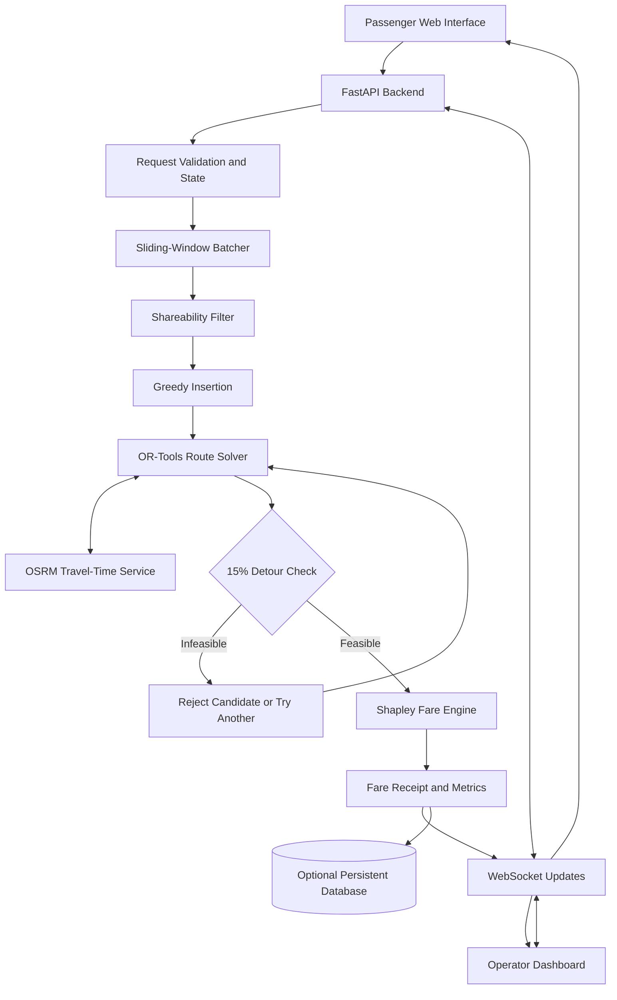

# Product Requirements Document (PRD)

# RidePool AI
## Algorithmic Ride-Pooling, Dynamic Batching & Shapley Fair-Fare Engine

**Document version:** 1.0  
**Date:** 9 October 2026  
**Product type:** Hackathon MVP · Web application · Optimization + Game Theory

---

## 1. Executive Summary

RidePool AI is a smart ride-pooling system that groups compatible ride requests, optimizes vehicle routes, limits passenger detours, and calculates explainable fares.

Traditional ride-pooling systems can match passengers and share vehicles, but this project focuses on a more specific challenge: **making shared rides efficient, keeping detours within a strict limit, and showing passengers how their fares were calculated.**

The product combines three core capabilities:

1. **Promise Engine:** Dynamic batching and constrained route optimization.
2. **Shapley Fair-Fare Engine:** Mathematical cost allocation with an explainable fare receipt.
3. **Proof Dashboard:** Live map, passenger detour indicators, and measurable comparisons against a simple baseline.

The initial prototype will simulate approximately 3 vehicles and 10–30 passenger requests in one city. It will use real road-map routing where available, a Python optimization backend, and a live web dashboard.

## 2. Problem Statement

### The Problem

Passengers travelling in similar directions often use separate vehicles, while shared-ride services can introduce inconvenient detours and fares that are difficult to explain.

The system must determine:

- When to group incoming requests.
- Which passengers should share a vehicle.
- The best order for pickups and drop-offs.
- Whether each passenger's detour stays within 15%.
- How to divide the shared journey cost fairly.
- How to explain the final result to passengers and fleet operators.

### Root Causes

| Problem | Consequence |
|---|---|
| Immediate, greedy matching | Good passenger combinations may be missed |
| Complex pickup-and-delivery routing | Long detours or inefficient vehicle use |
| Arbitrary fare splitting | Passengers question the fairness of their bills |
| Opaque decision-making | Users cannot verify why a route or fare was chosen |
| No objective comparison | Operators cannot measure whether pooling actually improved efficiency |

## 3. Product Vision and Objectives

**Vision:** Make shared transportation more trustworthy by combining route optimization, bounded detours, and transparent fare allocation.

### Objectives

- Group compatible requests dynamically rather than assigning every request independently.
- Enforce a maximum 15% detour for every passenger in an accepted route.
- Calculate shared fares using Shapley values.
- Prevent the final fare from exceeding the passenger's solo-fare ceiling through an explicitly documented adjustment policy.
- Show route, detour, fare, and savings information in a live dashboard.
- Benchmark the proposed engine against a basic greedy-matching baseline.
- Demonstrate an end-to-end working prototype rather than a static UI.

### Success Criteria

The project is successful when the prototype can accept or simulate ride requests, compute valid assignments, enforce the detour constraint, calculate and explain fares, and report reproducible evaluation metrics.

These are prototype goals, not claims of production-scale performance.

## 4. Target Users and Stakeholders

### Primary User: Repeat Commuter

Needs affordable rides, predictable journey times, clear detour limits, and an understandable fare receipt.

### Primary Business Customer: Fleet Operator

Needs improved vehicle utilization, reduced unnecessary kilometres, better dispatch decisions, and measurable operating efficiency.

### Supporting Stakeholder: Driver

Needs a feasible pickup/drop-off sequence, clear trip assignments, and transparent earnings information.

**Product strategy:** Design the passenger experience for commuters while demonstrating the operational and economic value to fleet operators. This user/customer distinction is emphasized in the prototype-development document.

## 5. Scope and Feature Prioritization

### 5.1 In Scope — MVP

#### FR-01: Ride Request Management
Create requests containing pickup, destination, request time, and passenger ID. Support manual input and simulated requests.

#### FR-02: Dynamic Batching
Buffer incoming requests in a rolling window, initially 15 seconds, with a configurable request-count trigger. Optimize when the timer expires or the threshold is reached.

#### FR-03: Passenger Compatibility Filtering
Eliminate obviously incompatible combinations using capacity, route proximity, and preliminary detour checks.

#### FR-04: Route Optimization
Build an initial solution using greedy insertion and refine it with OR-Tools. Enforce pickup-before-drop-off, vehicle capacity, and the per-passenger detour constraint.

#### FR-05: Shapley Fare Allocation
Compute exact Shapley values for small passenger groups using a clearly defined coalition-cost function. Apply and disclose the solo-fare ceiling adjustment where required.

#### FR-06: Live Map and Dashboard
Display vehicles, pickup/drop-off markers, planned routes, active requests, batching countdown, and optimization results.

#### FR-07: Explainable Fare Receipt
Show solo fare, shared fare, passenger's allocated amount, savings, detour percentage, and the marginal-contribution breakdown.

#### FR-08: Baseline Comparison
Compare the optimized engine with nearest-vehicle matching and a basic proportional fare split using the same simulated demand.

### 5.2 Out of Scope for the Initial MVP

- Real-money payments and payment-gateway integration.
- A fully deployed commercial ride-hailing service.
- Production driver onboarding, identity verification, and background checks.
- City-scale fleet deployment and guaranteed scalability to thousands of simultaneous requests.
- Machine-learning-based demand prediction or reinforcement learning for window selection.
- Advanced spatial sharding, blockchain, and AR/VR features.
- Automatic real-world driver dispatch and vehicle telematics.

These features may be considered later, but they are not required to prove the core problem has been solved.

## 6. Functional Requirements

The following IDs should be used in implementation tasks, test cases, and issue tracking.

| ID | Requirement | Priority |
|---|---|---|
| FR-01 | Create, validate, and store ride requests | P0 |
| FR-02 | Trigger request optimization by timer or batch size | P0 |
| FR-03 | Filter incompatible passenger combinations | P0 |
| FR-04 | Generate feasible vehicle assignments and stop sequences | P0 |
| FR-05 | Enforce the 15% per-passenger detour constraint | P0 |
| FR-06 | Calculate exact Shapley allocations for supported group sizes | P0 |
| FR-07 | Display a transparent fare breakdown | P0 |
| FR-08 | Show live map and current vehicle routes | P0 |
| FR-09 | Compare optimized results with a baseline | P0 |
| FR-10 | Preserve commitments during route re-optimization | P1 |
| FR-11 | Handle cancellation and no-feasible-match cases | P1 |
| FR-12 | Export or download evaluation results | P2 |

P0 requirements are necessary for the main demonstration. P1 and P2 requirements can follow once the end-to-end workflow is reliable.

## 7. Core User Journeys

### Journey A: A Passenger Requests a Ride

1. The passenger selects pickup and destination locations.
2. The frontend sends a validated ride request to the backend.
3. The request enters the batching buffer.
4. The batching timer expires or the batch-size threshold is reached.
5. The optimizer evaluates compatible passengers and available vehicles.
6. The system assigns the passenger to a feasible shared route, or explains why no match was found.
7. The passenger can view the planned route, estimated detour, and fare breakdown.

### Journey B: The Operator Monitors Vehicles

1. The operator opens the dashboard.
2. Vehicle positions and incoming ride requests appear on the map.
3. The dashboard shows the active batching window and its countdown.
4. The engine proposes a pickup/drop-off sequence and validates its constraints.
5. The operator sees route efficiency, vehicle distance, accepted requests, and fare allocation metrics.

### Journey C: A New Passenger Request Arrives During a Trip

The engine may attempt to insert the new request into an existing vehicle route. It must freeze the already-completed route prefix and check that every existing passenger continues to satisfy the detour and timing constraints. Existing quoted fares must not increase under the proposed price-ceiling policy.

If no feasible insertion exists, the engine rejects that insertion and retains the existing valid plan.

## 8. Algorithm and Optimization Specification

This is the mathematical core of the product.

### 8.1 Dynamic Batching

**Method:** Sliding-window batching.

- Initial window duration: 15 seconds.
- Optional trigger: configured maximum number of queued requests.
- On triggering: select eligible requests and run the optimizer.
- Requests arriving during optimization remain queued for a subsequent batch.
- Avoid processing the same request twice.

The 15-second value is a prototype default, not a universally optimal interval.

### 8.2 Route Optimization

**Method:** Greedy insertion followed by OR-Tools refinement.

The route optimizer must respect:

- Vehicle capacity.
- Pickup before the corresponding drop-off.
- Valid pickup and drop-off locations.
- Travel-time and, where configured, time-window constraints.
- A maximum 15% passenger detour.
- Existing route commitments and completed stops.

Define the detour consistently. For the MVP, use travel time as the primary measure:

\[
\text{Detour}_i =
\frac{T_i^{\text{pooled}}-T_i^{\text{solo}}}
{T_i^{\text{solo}}}\times100\%
\]

where \(T_i^{\text{solo}}\) is the estimated direct solo travel time and \(T_i^{\text{pooled}}\) is the passenger's planned in-vehicle time.

Accept the route only if:

\[
\text{Detour}_i \leq 15\%
\quad \text{for every passenger }i
\]

Use consistent road-network travel-time estimates for both measurements. Do not substitute the total shared route length for an individual passenger's detour.

### 8.3 Shapley Fair-Fare Calculation

**Method:** Exact permutation-based Shapley values for small groups.

Let \(N\) be the set of passengers and \(v(S)\) the defined minimum route cost for serving passenger subset \(S\). For passenger \(i\):

\[
\phi_i =
\sum_{S\subseteq N\setminus\{i\}}
\frac{|S|!(n-|S|-1)!}{n!}
\big[v(S\cup\{i\})-v(S)\big]
\]

The algorithm calculates the average additional cost attributable to passenger \(i\) across all possible orderings.

For the prototype, define \(v(S)\) using minimum feasible pickup-and-delivery route cost while **evaluating the accounting game without the 15% detour cap**. The detour cap remains a separate operational constraint on actual dispatch. This makes the coalition-cost function defined for all subsets under the same routing cost model.

#### Fare Allocation Rules

1. The unadjusted Shapley allocations should sum to the cost of the full passenger coalition.
2. Display each passenger's marginal contribution and the allocated share.
3. If an allocation exceeds the passenger's solo fare, apply the individual-rationality adjustment specified by the product policy and disclose it.
4. Reconcile any adjustment so final fares sum to the amount the system intends to recover.
5. Report when the adjustment changes the raw Shapley allocation.

**Important trade-off:** The solo-fare ceiling adjustment may change the raw Shapley values and therefore may not preserve every Shapley axiom. The UI must distinguish raw allocations from adjusted payable fares.

### 8.4 Baseline Algorithms

Build two deliberately simple comparison methods:

- Nearest-vehicle or first-fit greedy matching.
- Distance-proportional fare splitting.

These are evaluation baselines, not the proposed final solution.

## 9. System Architecture

### 9.1 High-Level Architecture



### 9.2 Recommended Technology Stack

| Layer | Technology | Responsibility |
|---|---|---|
| Frontend | React + Vite + TypeScript | Rider request interface and operator dashboard |
| Map | Leaflet + OpenStreetMap | Map display, markers, and route lines |
| Backend | Python + FastAPI | API endpoints and application logic |
| Optimization | Google OR-Tools | Vehicle routing and pickup/drop-off constraints |
| Initial routing heuristic | Python greedy insertion | Generate a feasible starting solution |
| Travel-time service | OSRM | Road-network distances and travel times |
| Fair-fare engine | Python | Shapley value calculation and fare adjustment |
| Real-time communication | WebSockets | Push new requests, routes, and results |
| State management | In-memory Python structures | Initial active requests, vehicles, and batches |
| Optional persistence | PostgreSQL/PostGIS | Store trips, locations, and historical metrics |
| Testing | pytest and frontend test tools | Algorithm and interface validation |

For the hackathon MVP, do not introduce Redis or a persistent database unless the team needs them. In-memory state is sufficient for a single-process demonstration, but it will not survive process restarts.

### 9.3 Deployment Architecture

- Deploy the React frontend as a static web application.
- Deploy FastAPI as a Python web service.
- Connect the frontend to the backend through HTTPS and secure WebSocket connections.
- Configure the routing service URL through environment variables.
- Keep routing API credentials, if any, on the server.
- Use synthetic requests when external routing is unavailable, while clearly labeling simulated travel estimates.

The prototype should not depend on an unverified public routing service remaining available during the judging session.

## 10. Data Requirements and Data Model

The initial prototype can work with synthetic demand. Real passenger histories are not required.

### Core Entities

#### RideRequest

One passenger's requested journey.

`request_id`, `passenger_id`, `pickup`, `dropoff`, `request_time`, `solo_eta`, `status`

#### Vehicle

An available vehicle and its current plan.

`vehicle_id`, `current_location`, `capacity`, `occupied_seats`, `status`, `planned_stops`

#### RouteAssignment

A validated route assigned to a vehicle.

`assignment_id`, `vehicle_id`, `request_ids`, `stop_sequence`, `route_cost`, `status`

#### FareAllocation

A passenger's fare calculation and explanation.

`request_id`, `solo_fare`, `raw_shapley_share`, `adjusted_fare`, `savings`, `explanation`

### Data Integrity Rules

- Each ride request must have a unique identifier.
- A request cannot be assigned to multiple active vehicles.
- Every pickup must precede its corresponding drop-off.
- Completed stops cannot be moved during re-optimization.
- Every accepted assignment must satisfy capacity and detour constraints.
- Raw fare allocations and adjusted fares must be stored separately.
- Final payable fares must reconcile with the declared fare-recovery total.

## 11. API Requirements

These are proposed endpoint contracts for the implementation team.

| Method | Endpoint | Purpose |
|---|---|---|
| `POST` | `/api/v1/requests` | Create a passenger request |
| `GET` | `/api/v1/requests` | List active and historical requests |
| `POST` | `/api/v1/simulation/start` | Start simulated demand |
| `POST` | `/api/v1/simulation/stop` | Stop simulated demand |
| `GET` | `/api/v1/vehicles` | Retrieve vehicle states |
| `GET` | `/api/v1/assignments/{id}` | Retrieve an assignment and its route |
| `GET` | `/api/v1/fares/{request_id}` | Retrieve fare details |
| `GET` | `/api/v1/metrics` | Retrieve evaluation metrics |
| `WS` | `/ws/live` | Stream live simulation and optimizer events |

The endpoints are proposed design decisions, not existing APIs.

### Example Ride Request

```json
{
  "request_id": "R001",
  "passenger_id": "P001",
  "pickup": {
    "lat": 18.5204,
    "lng": 73.8567
  },
  "dropoff": {
    "lat": 18.5679,
    "lng": 73.9143
  },
  "request_time": "2026-10-09T09:00:00+05:30"
}
```

The coordinates above are illustrative test data, not a recommended operational route.

## 12. User Interface Requirements

### 12.1 Operator Dashboard

#### A. Overview Panel
Active vehicles, incoming requests, served passengers, pending requests, and current batch status.

#### B. Live Route Map
Vehicle locations, pickup/drop-off markers, planned routes, and a clear distinction between accepted and rejected matches.

#### C. Analytics Panel
Vehicle kilometres, passenger detours, average fare savings, service rate, and baseline comparison.

#### D. Fare Explanation
Solo fare, raw Shapley allocation, final adjusted fare, savings, and the cost-contribution explanation.

### 12.2 UI Behavior Requirements

- A passenger's detour indicator is green when the planned detour is at or below 15% and red when a candidate is rejected for exceeding the limit.
- Show the numerical detour value alongside the color.
- Clearly distinguish estimated, planned, and actual travel times.
- Display a meaningful message when no compatible vehicle is available.
- Update the interface when assignments change.
- Explain fare adjustments rather than showing only a final amount.
- Label simulated vehicles and trips as simulations.

## 13. Non-Functional Requirements

These are proposed engineering targets for the MVP and should be verified through testing.

| Category | Requirement |
|---|---|
| Correctness | No accepted route may violate the enforced detour, capacity, or pickup/drop-off constraints |
| Solver performance | Aim to complete each small batch within 1–2 seconds, excluding external routing latency |
| Batch latency | Trigger optimization when the configured window or size condition is met |
| Real-time updates | Aim for dashboard updates within 1 second after the backend emits an event under local demo conditions |
| Reliability | Handle routing failures and infeasible batches without corrupting existing assignments |
| Security | Validate input, restrict operator controls, and keep secrets out of frontend code |
| Maintainability | Keep batching, routing, fare calculation, and UI code in separate modules |
| Explainability | Store enough calculation details to reproduce the fare receipt |
| Accessibility | Use readable text, keyboard-accessible controls, and indicators that do not rely on color alone |
| Reproducibility | Support fixed random seeds for benchmark runs |

Performance figures are goals, not established measurements. Routing API latency, machine specifications, and solver configuration may affect the results.

## 14. Evaluation Metrics and Acceptance Criteria

The project must prove that the algorithms work, not simply that the dashboard looks good.

| Metric | How to Measure It | Acceptance Criteria |
|---|---|---|
| Detour compliance | Percentage of accepted passengers with detour ≤15% | 100% of accepted passengers in tested scenarios |
| Vehicle capacity | Maximum onboard passengers per vehicle | Never exceed configured capacity |
| Pickup/drop-off validity | Validate stop precedence | Every pickup precedes its drop-off |
| Fare reconciliation | Sum of final passenger fares versus target fare recovery | Difference within ₹0.01 for currency calculations |
| Solo-fare ceiling | Compare each adjusted fare with solo fare | No passenger pays above the ceiling |
| Batching | Record request arrival and batch-trigger timestamps | Timer and size triggers behave as configured |
| Baseline comparison | Run both algorithms on the same demand seed | Report results honestly; no predetermined improvement is assumed |
| Fare explainability | Reproduce the allocation from stored inputs | Every displayed allocation can be traced to its calculation |

### Important Distinction

A system can enforce the detour limit and still fail to serve some passengers. Therefore, report both **detour compliance** and **passenger service rate**. Do not make the service rate look better by silently dropping difficult requests.

### Benchmark Metrics

Include these in the dashboard:

- Total vehicle kilometres.
- Passengers served and rejected.
- Average and 95th-percentile passenger detour.
- Average fare savings.
- Optimization latency.
- Raw Shapley allocations versus adjusted fares.
- Fare-savings distribution, including a Gini coefficient if implemented.

## 15. Testing Strategy

### Unit Testing
Test detour calculations, batching triggers, capacity checks, Shapley calculations, and fare reconciliation independently.

### Integration Testing
Submit ride requests through the API and verify that they move through batching, optimization, fare calculation, and dashboard updates.

### Constraint and Edge-Case Testing
Test full vehicles, impossible detours, duplicate requests, cancellations, no compatible vehicles, routing failures, and requests arriving during re-optimization.

### Benchmark Testing
Run baseline and optimized algorithms with identical inputs and compare their metrics. Repeat experiments with fixed seeds to make results reproducible.

### Essential Shapley Test

For a small passenger group, independently verify that:

1. The coalition-cost function is defined for every subset.
2. The Shapley calculation agrees with a hand-calculated example.
3. Raw allocations sum to the full coalition cost.
4. Any solo-fare adjustment is applied consistently and separately reported.

## 16. Development Roadmap

The following is a suggested seven-day implementation plan for a small team.

| Day | Focus | Deliverable |
|---|---|---|
| Day 1 | Specification and mathematical definitions | Final detour metric, route-cost function, batch policy, and fare-allocation rules |
| Day 2 | Request simulator and batching | Passenger request generator, batch buffer, timer/size triggers |
| Day 3 | Routing and constraints | Greedy insertion, OR-Tools optimization, detour/capacity validation |
| Day 4 | Shapley fare engine | Exact fare allocation, solo-fare adjustments, calculation explanations |
| Day 5 | Frontend and live map | React dashboard, map, route indicators, countdown, fare receipt |
| Day 6 | Integration and benchmarks | Connected components, baseline comparison, edge-case tests |
| Day 7 | Deployment and presentation | Deployed prototype, repeatable scenarios, measured results |

The schedule assumes the team can work in parallel and that external routing services are available. The optimization and fare-calculation components deserve the most careful testing.

## 17. Risks and Mitigations

| Risk | Mitigation |
|---|---|
| No real-time demand dataset | Use synthetic requests and clearly label the simulation |
| Public routing service is unavailable | Cache travel times or prepare a local routing fallback |
| OR-Tools cannot find a feasible route within the time budget | Use insertion heuristics first, then refine with a bounded solver time |
| Shapley allocations exceed solo fares | Apply the disclosed individual-rationality adjustment |
| New requests break existing promises | Freeze completed stops and reject infeasible insertions |
| Dashboard shows a route that violates constraints | Display only validated assignments as accepted routes |
| Claimed savings are not reproducible | Use the same request seed and cost assumptions for baseline comparisons |
| Small demo is mistaken for city-scale validation | Clearly state the number of vehicles, passengers, and scenarios tested |

## 18. Future Enhancements

Only after the MVP works correctly should the team consider:

- Demand-adaptive batching using contextual bandits or reinforcement learning.
- Large-fleet scaling using geographic partitioning and parallel optimization.
- Approximate Shapley calculations for vehicles with many passengers.
- Scheduled corporate and campus transport.
- Persistent trip history and operator analytics.
- Driver interfaces and real-world GPS integration.
- Cancellation prediction and demand forecasting.

These are future possibilities, not MVP commitments.

## 19. Final Definition of Done

Use this checklist before presenting the prototype.

- [ ] Passenger requests can be created manually and through simulation.
- [ ] Batching works with a timer and a configurable size trigger.
- [ ] The optimizer generates valid pickup/drop-off sequences.
- [ ] The 15% per-passenger detour constraint is actually enforced.
- [ ] Vehicle capacity and existing route commitments are validated.
- [ ] Shapley fare allocations are calculated and independently tested.
- [ ] Solo-fare adjustments and final fare reconciliation are correct.
- [ ] The live dashboard shows requests, routes, detours, and fare receipts.
- [ ] The baseline comparison runs on the same simulated demand.
- [ ] Performance and service metrics are measured rather than invented.
- [ ] At least one infeasible-route scenario is demonstrated correctly.
- [ ] The project can be run from documented setup instructions.

## 20. Product Summary

RidePool AI is a constrained vehicle-routing and explainable cost-allocation system, not merely a carpooling interface.

Its central workflow is:

**Dynamic batching → Greedy insertion → OR-Tools route optimization → 15% detour validation → Shapley fare allocation → Live dashboard and benchmarking.**

The MVP should demonstrate three things convincingly: **the route respects its constraints, the fare calculation is auditable, and the results can be compared against a simple baseline.**

That is the foundation on which the larger product can be built.
