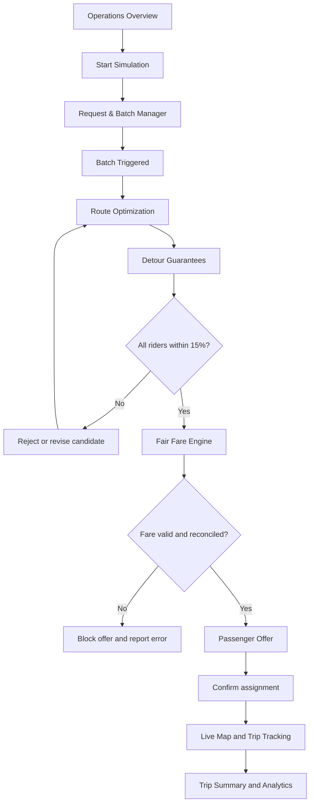
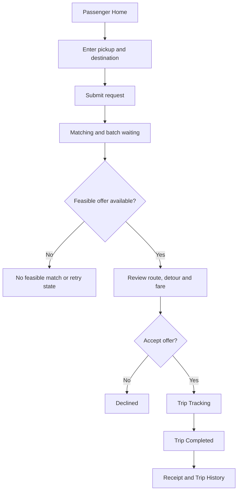

# RidePool AI — Screen-by-Screen UI Generation Prompts

> **Purpose:** Copy-ready prompts for generating the individual screens of the RidePool AI application.  
> **Important:** These prompts focus on screen content, functionality, interactions, states, and how screens connect. They intentionally do not prescribe a visual design system, color palette, typography, or component library.  
> **Product:** RidePool AI — algorithmic ride-pooling with dynamic batching, route optimization, a strict 15% passenger detour cap, and explainable Shapley-based fare allocation.

---

# How to Use This Prompt Pack

1. Generate the **shared application shell** first.
2. Generate the operations dashboard screens in the order listed below.
3. Generate the passenger screens.
4. Ask the UI generator to keep navigation, request data, route data, and status transitions consistent across all screens.
5. Treat the generated screens as frontend prototypes. Route optimization, detour validation, and Shapley calculations must come from the backend, not from UI-only calculations.
6. Use synthetic data for the demo and label it as simulated. Do not hardcode fake benchmark results as if they were real.

## Global Context to Include in Every Screen Prompt

Copy this context into each prompt, or tell your UI generator to treat it as persistent project context:

> Build a screen for RidePool AI, a ride-pooling platform and algorithm demonstration. The system accepts passenger ride requests, groups compatible requests into rolling batches, optimizes vehicle assignments and pickup/drop-off order, validates that every served passenger's estimated in-vehicle travel-time detour is no more than 15%, and calculates explainable fare shares using Shapley values. The app has two experiences: an Operations Dashboard for monitoring and demonstrating the algorithms, and a Passenger Experience for requesting, confirming, and tracking a shared ride. All screens must share the same request IDs, vehicle IDs, route data, fare data, and lifecycle statuses. Use clearly labelled synthetic/demo data until real backend results are connected. Do not fabricate algorithm results. Include loading, empty, error, and success states where relevant.

---

# Part A — Shared Application Shell

## Prompt 0: Application Shell and Navigation

**Copy-ready prompt**

> Create the overall application shell for RidePool AI. The application has two main entry points: **Passenger Demo** and **Operations Dashboard**.
>
> The shell must support navigation between all screens without losing the active simulation state. The operations experience should have persistent navigation for Overview, Live Map, Request & Batch Manager, Route Optimization, Detour Guarantees, Fair Fare Engine, Benchmark & Analytics, and Simulation Settings. The passenger experience should have navigation for Home, My Ride, Trips, and optional Profile.
>
> Include a clear indicator of whether the app is in simulation/demo mode. The operations shell must expose global simulation controls such as Start, Pause, Reset, and Run Next Batch where appropriate. The passenger shell must show the active request/trip status when a request exists.
>
> The shell must not invent a separate state for each screen. Screens should consume a shared application state or API service. Selecting a request or vehicle on one operations screen should open the same entity on the relevant detail screen.
>
> Define navigation routes for all screens. Include a not-found state and a clear way to return to the relevant dashboard.
>
> **Expected output:** the shell, navigation structure, route map, shared state boundaries, and all screen route placeholders. Do not build the algorithm itself in the frontend.

**Screens connected:** all operations and passenger screens.

---

# Part B — Operations Dashboard

## Prompt 1: Operations Overview Dashboard

**Route suggestion:** `/ops/overview`

**Copy-ready prompt**

> Build the RidePool AI Operations Overview screen. This is the main screen used by the hackathon team to start a simulation and explain the system to judges.
>
> ### Main content
> 1. A simulation status area showing `Stopped`, `Running`, `Paused`, or `Error`.
> 2. KPI cards for incoming requests, requests waiting in the current batch, active vehicles, active assignments, served requests, unmatched requests, and detour violations.
> 3. A batch status panel showing the current batch ID, elapsed time, remaining countdown, configured batch window, and trigger type (`Timer`, `Request threshold`, or `Manual demo trigger`).
> 4. A live map preview showing vehicles, pickup points, drop-off points, and assigned routes.
> 5. A recent events panel showing timestamped events such as request received, batch started, optimization completed, route rejected, fare calculated, and trip completed.
> 6. A system health panel showing routing service status, optimizer status, WebSocket connection status, and last update time.
>
> ### Actions
> - `Start Simulation`: starts the configured synthetic demand scenario.
> - `Pause`: pauses future simulation progression without deleting the current state.
> - `Run Next Batch`: processes a batch immediately for demonstration; mark it as a manual trigger.
> - `Reset Simulation`: asks for confirmation, then clears the current run and resets the scenario.
> - Clicking a KPI opens the relevant filtered screen.
> - Clicking a map marker or event opens the related request, vehicle, or assignment.
>
> ### Behavior
> - Populate KPIs from the current backend/simulation state.
> - Update the screen from live events when connected.
> - Never display placeholder values as actual results. If the simulation has not run, show empty-state guidance.
> - If the backend is disconnected, show stale-data/connection status and do not imply that the screen is live.
>
> ### States to generate
> Initial idle state, running state, paused state, no requests state, connection error state, and completed simulation state.
>
> **Expected output:** a functional overview screen with working navigation and controls wired to mock service functions or documented API calls.

---

## Prompt 2: Live Fleet and Route Map

**Route suggestion:** `/ops/map`

**Copy-ready prompt**

> Build the RidePool AI Live Map screen. It must help an operator understand where vehicles are, which passengers are assigned to each vehicle, and how the planned routes serve pickups and drop-offs.
>
> ### Main content
> 1. A large interactive map.
> 2. Vehicle markers with vehicle ID, occupancy/capacity, current status, and assigned route.
> 3. Pickup markers and drop-off markers for every active or pending request.
> 4. Route lines grouped by vehicle.
> 5. A legend explaining vehicle, pickup, drop-off, pending, validated, and rejected-candidate states.
> 6. A side panel listing vehicles and their current assignments.
> 7. A selected-entity panel that appears when a vehicle, request, or route is clicked.
> 8. Map filters for all vehicles, one vehicle, pending requests, active trips, and rejected candidates.
>
> ### Interactions
> - Clicking a vehicle selects it and displays its ordered stop list, occupancy, estimated route duration, and assigned passenger IDs.
> - Clicking a passenger marker displays their solo estimate, pooled estimate, detour percentage, fare status, and request lifecycle state.
> - Clicking a stop in the stop list focuses the map on that stop.
> - Toggling a vehicle filter shows or hides that vehicle's route without deleting the assignment.
> - A rejected candidate route may be shown for explanation, but must be visually and textually identified as rejected rather than dispatched.
>
> ### Behavior
> - Read positions and routes from shared simulation state.
> - If only simulated vehicle movement is available, label it as simulated.
> - Distinguish planned route segments from completed route segments.
> - Selecting an entity must open the same entity details used by other screens.
>
> ### States
> No vehicles, no active routes, loading map data, routing data unavailable, live connection lost, and normal active simulation.
>
> **Expected output:** interactive map screen with synchronized filters and entity details.

---

## Prompt 3: Request Queue and Dynamic Batch Manager

**Route suggestion:** `/ops/batches`

**Copy-ready prompt**

> Build the RidePool AI Request & Batch Manager. This screen explains how incoming ride requests are collected into rolling batches before route optimization.
>
> ### Main content
> 1. A table or list of incoming requests with request ID, pickup, destination, request time, party size, solo travel-time estimate, current status, and batch ID.
> 2. A batch panel showing the active batch ID, batch creation time, countdown, request count, configured time-window length, and whether the batch will trigger by timer or request-count threshold.
> 3. A batch history section listing completed batches, processing time, requests included, and batch outcome.
> 4. A compatibility preview showing candidate requests that may be shareable, clearly labelled as candidates rather than confirmed assignments.
> 5. Filters for request state, batch ID, party size, and unmatched requests.
>
> ### Actions
> - `Generate Request`: creates one synthetic request using the configured scenario generator.
> - `Generate Demand`: generates a chosen number of synthetic requests.
> - `Process Batch Now`: manually triggers processing for the demo and records the trigger reason as `manual`.
> - `Open Request`: navigates to the request's detail context.
> - `View Batch Result`: opens the corresponding route-optimization result.
>
> ### Behavior
> - New requests enter `pending` and are assigned to the active batch according to the batching policy.
> - When the timer expires or the request threshold is reached, the batch changes to `processing`.
> - Prevent the same batch from being processed twice.
> - After processing, mark the batch completed and show the result, including matched and unmatched requests.
> - A candidate compatibility result must not be presented as a guaranteed feasible route.
>
> ### States
> Empty queue, countdown active, processing batch, completed batch, all requests unmatched, and generation error.
>
> **Expected output:** working request queue and batch lifecycle UI with a visible explanation of why and when a batch is processed.

---

## Prompt 4: Request Details Drawer or Page

**Route suggestion:** `/ops/requests/:requestId`

**Copy-ready prompt**

> Build a detailed request inspection screen for a selected RidePool AI passenger request.
>
> ### Main content
> - Request ID and current lifecycle status.
> - Pickup and destination.
> - Request creation time and current batch.
> - Party size and any supported constraints.
> - Solo reference route, distance, travel time, and reference fare.
> - Current assignment and vehicle, if assigned.
> - Candidate pools evaluated for the request.
> - Detour validation result, if a route candidate exists.
> - Fare calculation status.
> - Timestamped request event history.
>
> ### Actions
> - Navigate to the relevant batch.
> - Navigate to the assigned vehicle/route.
> - Open the fare explanation if available.
> - Cancel a pending request in the simulation, with confirmation.
> - Re-run matching only if the backend supports this action and the screen explains its effect.
>
> ### Behavior
> - Render a clear timeline from `pending` through matching, validation, offer, confirmation, and completion.
> - If the request is unmatched, display the actual reason returned by the backend.
> - Do not invent a route, fare, or detour when the backend has not produced one.
>
> **Expected output:** an inspection view that links request, batch, route, validation, and fare records together.

---

## Prompt 5: Route Optimization and Assignment Results

**Route suggestion:** `/ops/optimization`

**Copy-ready prompt**

> Build the RidePool AI Route Optimization screen. Its purpose is to show how requests are assigned to vehicles and how pickup/drop-off stop order is selected.
>
> ### Main content
> 1. Optimization run summary: batch ID, algorithm name, start/end time, solver status, and measured runtime.
> 2. A list of candidate and final vehicle assignments.
> 3. For each vehicle: capacity, assigned passengers, ordered stop list, estimated route distance, and estimated duration.
> 4. A route comparison area showing the initial greedy-insertion route versus the optimized route when both results exist.
> 5. A constraints panel checking capacity, pickup-before-drop-off precedence, time windows if implemented, and the passenger detour cap.
> 6. A rejected-candidates list with a specific rejection reason for each candidate.
>
> ### Actions
> - `Run Optimizer`: submits the selected batch to the backend optimizer.
> - `Compare Routes`: compares the initial route and optimized route using the same demand and travel-time matrix.
> - `Inspect Assignment`: opens assignment details and the map focused on that vehicle.
> - `Inspect Rejection`: opens the constraint explanation for a rejected candidate.
>
> ### Behavior
> - The frontend must not perform its own optimization or declare a route feasible independently.
> - Show solver states such as `queued`, `running`, `feasible solution found`, `no feasible solution`, `timeout`, and `error`.
> - Do not label a route as final until the backend's detour validator has accepted it.
> - If no feasible assignment exists, explain that outcome and preserve the rejected candidate details for analysis.
>
> ### States
> No batch selected, optimizer running, feasible result, no feasible solution, solver timeout, and optimizer error.
>
> **Expected output:** a route-inspection interface that exposes assignment decisions and constraint results.

---

## Prompt 6: Detour Guarantee and Constraint Validation

**Route suggestion:** `/ops/detours`

**Copy-ready prompt**

> Build the RidePool AI Detour Guarantees screen. This screen is responsible for making the 15% maximum passenger detour rule visible and auditable.
>
> ### Main content
> 1. A summary showing passengers checked, passengers within the limit, rejected candidate routes, and current violations in proposed or active routes.
> 2. A per-passenger table with request ID, solo travel time, pooled travel-time estimate, added time, detour percentage, configured limit, validation status, and reason.
> 3. A detail panel for the selected passenger showing the solo route and pooled route.
> 4. A candidate-route history showing accepted and rejected candidates.
> 5. A clear explanation of the detour formula:
>
>    `Detour % = ((Pooled travel time - Solo travel time) / Solo travel time) × 100`
>
> ### Actions
> - Filter to only rejected candidates.
> - Select a passenger and focus the map on their route.
> - Open the associated assignment.
> - Inspect the reason for rejection.
> - Request a new optimization run only through the backend's supported action.
>
> ### Behavior
> - Use the same travel-time metric and consistent routing assumptions for solo and pooled estimates.
> - For the MVP, use estimated in-vehicle travel time unless the project explicitly implements another metric.
> - A candidate is dispatchable only if every passenger meets the 15% cap and all other hard constraints pass.
> - Handle zero or missing solo travel time explicitly; do not divide by zero or silently mark the passenger as valid.
> - Preserve rejected candidates for audit and debugging.
>
> ### States
> All valid, rejected candidate, no data, invalid solo baseline, routing estimate unavailable, and validation error.
>
> **Expected output:** a constraint-audit screen with per-passenger evidence, not just a green/red summary badge.

---

## Prompt 7: Shapley Fair Fare Engine

**Route suggestion:** `/ops/fares`

**Copy-ready prompt**

> Build the RidePool AI Fair Fare Engine screen. The purpose is to explain how a shared route's cost is allocated among passengers using Shapley values.
>
> ### Main content
> 1. A list of completed fare calculations with request group, assignment ID, coalition size, route cost, calculation status, and reconciliation status.
> 2. A selected coalition panel showing all passengers in the pool.
> 3. A fare table with passenger ID, solo reference fare, raw Shapley share, any adjustment, adjusted payable fare, and cap status.
> 4. An expandable calculation explanation showing the coalition cost function `v(S)`, the passenger's marginal contribution, and how the raw Shapley share was obtained.
> 5. A reconciliation panel comparing the sum of raw Shapley shares with the coalition route cost and the sum of final payable fares with the chosen fare-recovery target.
> 6. A warning state if the fare calculation is incomplete or fails reconciliation.
>
> ### Actions
> - Select a coalition/assignment.
> - Expand the calculation for a passenger.
> - Compare raw Shapley shares with adjusted payable fares.
> - Copy or export the explanation if supported.
> - Navigate to the passenger request or route assignment.
>
> ### Behavior
> - Fetch calculations from the backend.
> - Do not calculate or change final fares in the frontend.
> - Raw Shapley shares must be distinguished from adjusted shares.
> - If a share exceeds the solo-fare cap and a redistribution policy is applied, show the adjustment and its effect on the allocation.
> - Show a successful reconciliation only after the backend verifies it.
> - If no fare exists, show `Not calculated` rather than a fabricated example as a live result.
>
> ### States
> Calculation pending, calculation complete, adjusted fare, reconciliation error, missing fare data, and unsupported coalition size.
>
> **Expected output:** an auditable fare screen that explains both the mathematical allocation and any product-policy adjustments.

---

## Prompt 8: Benchmark and Analytics

**Route suggestion:** `/ops/analytics`

**Copy-ready prompt**

> Build the RidePool AI Benchmark & Analytics screen. It compares the optimized routing approach against a basic greedy or nearest-vehicle baseline.
>
> ### Main content
> 1. A benchmark configuration panel showing scenario seed, request count, fleet size, capacity, routing assumptions, and algorithm being tested.
> 2. A comparison table for `Optimized` and `Baseline`.
> 3. Metrics: served requests, unmatched requests, service rate, total vehicle-kilometres, mean detour, 95th-percentile detour, detour violations, fare savings, optional Gini coefficient of savings, solver runtime, and routing-provider latency.
> 4. Charts comparing the selected metrics.
> 5. A run history with timestamp, scenario settings, and status.
> 6. A note indicating whether the displayed results are synthetic simulation results or real observations.
>
> ### Actions
> - `Run Benchmark`: executes both methods against the same request set and assumptions.
> - Select a prior benchmark run.
> - Choose metrics to compare.
> - Export the result if export is implemented.
> - Open the underlying batch or route result.
>
> ### Behavior
> - Both algorithms must use the same demand seed, fleet, capacity, and travel-time assumptions.
> - Define how unmatched requests are counted.
> - Distinguish solver runtime from external routing latency.
> - Do not hardcode sample metrics or imply that an unrun benchmark has results.
> - If a run fails, preserve the error and do not display partial results as complete.
>
> ### States
> No benchmark history, benchmark running, completed comparison, failed run, and missing metric.
>
> **Expected output:** an honest and reproducible comparison screen that helps demonstrate the benefit and limitations of the optimization approach.

---

## Prompt 9: Simulation Settings

**Route suggestion:** `/ops/settings`

**Copy-ready prompt**

> Build the RidePool AI Simulation Settings screen. It lets an operator configure a repeatable scenario without editing code.
>
> ### Inputs
> - Number of vehicles
> - Vehicle capacity
> - Number of synthetic requests
> - Batch-window duration
> - Optional request-count trigger
> - Random seed
> - Request generation interval
> - Detour cap, defaulting to 15%
> - Baseline algorithm
> - Predefined demo area or scenario
>
> ### Actions
> - `Apply Settings`
> - `Start Simulation`
> - `Reset Scenario`
> - `Run One Batch`
> - `Restore Defaults`
>
> ### Behavior
> - Validate input ranges and show helpful errors.
> - Explain that changing the detour cap changes the experiment, not the product's default promise.
> - Do not silently change settings while a benchmark is running.
> - Ask for confirmation before resetting an active scenario.
> - Display the current configuration on the overview and benchmark screens.
> - Preserve the random seed so a scenario can be reproduced.
>
> **Expected output:** a settings form connected to simulation configuration, with validation and clear effects on subsequent runs.

---

## Prompt 10: Simulation Event Log and Error Inspector

**Route suggestion:** `/ops/events` or a panel on Overview

**Copy-ready prompt**

> Build an event log for RidePool AI that helps a demo operator understand what the system is doing.
>
> ### Event types
> - Request created
> - Request added to batch
> - Batch triggered
> - Compatibility candidate found
> - Optimization started
> - Candidate rejected
> - Detour validation completed
> - Fare calculation completed
> - Assignment confirmed
> - Vehicle moved
> - Trip completed
> - Routing error
> - Solver timeout
> - WebSocket disconnected/reconnected
>
> ### Each event should show
> - Timestamp
> - Event type
> - Related request, batch, vehicle, or assignment ID
> - Short human-readable message
> - Severity or outcome
> - Optional details payload
>
> ### Interactions
> - Filter by event type and severity.
> - Click an event to open its related entity.
> - Expand technical details when available.
> - Clear only the visible filter, not the underlying simulation history.
>
> **Expected output:** a live or replayable event log that uses the same IDs and timestamps as the other screens.

---

# Part C — Passenger Experience

## Prompt 11: Passenger Home and Route Planning

**Route suggestion:** `/ride`

**Copy-ready prompt**

> Build the RidePool AI Passenger Home screen. A passenger should be able to enter a pickup and destination and request a shared ride without understanding the optimization algorithm.
>
> ### Main content
> 1. Map with pickup and destination markers.
> 2. Pickup location search field.
> 3. Destination search field.
> 4. Current-location control if location permission is available.
> 5. Party-size selector.
> 6. Solo route estimate showing travel time, distance, and reference fare.
> 7. A clear button to request a shared ride.
> 8. A small explanation that the app searches for a compatible pool and validates the detour before presenting an offer.
>
> ### Interactions
> - Search/select pickup.
> - Search/select destination.
> - Choose party size.
> - Preview or refresh the solo estimate.
> - Submit the request.
>
> ### Behavior
> - Validate that pickup and destination are present and different.
> - Create a request through the backend.
> - On successful submission, navigate to the Matching screen using the returned request ID.
> - Prevent duplicate submissions while a request is being created.
> - If routing is unavailable, explain that the solo estimate could not be calculated and follow the configured fallback policy.
>
> ### States
> Empty form, location search, route calculation, ready to request, invalid input, routing error, and request submission error.
>
> **Expected output:** a usable ride request screen with a clear next step and no unnecessary algorithmic controls.

---

## Prompt 12: Matching and Batch Waiting Screen

**Route suggestion:** `/ride/matching/:requestId`

**Copy-ready prompt**

> Build the passenger Matching screen for RidePool AI. It explains that the request has entered the matching process and may be grouped with compatible requests during a rolling batch window.
>
> ### Main content
> - Request ID and request status.
> - Pickup and destination summary.
> - Current batch status, if available.
> - Countdown to the next scheduled batch trigger, if available.
> - Progress stages: `Request received`, `Waiting for batch`, `Matching`, `Validating route`, and `Calculating fare`.
> - Short explanation of the current stage.
> - Cancel request action while cancellation is still allowed.
>
> ### Behavior
> - Subscribe to request updates from the backend or poll a status endpoint.
> - Update the screen when the request transitions to another state.
> - If an offer is ready, navigate to the Offer screen.
> - If no feasible match exists, show a no-match explanation and available next action.
> - If a technical error occurs, show a retry option only when retrying is safe.
> - Do not invent a countdown if the backend does not expose batch timing.
>
> ### States
> Waiting, matching, validating, fare calculation, offer ready, no feasible match, cancelled, and system error.
>
> **Expected output:** a status-driven waiting screen connected to the actual request lifecycle.

---

## Prompt 13: Passenger Pool Offer and Fare Explanation

**Route suggestion:** `/ride/offer/:requestId`

**Copy-ready prompt**

> Build the RidePool AI Passenger Offer screen. It presents a feasible shared-ride proposal and explains its fare before the passenger accepts.
>
> ### Main content
> 1. Proposed route map with pickup, drop-off, and shared stops relevant to the passenger.
> 2. Estimated pickup time and arrival time.
> 3. Passenger's solo travel-time estimate.
> 4. Passenger's pooled travel-time estimate.
> 5. Detour percentage and the 15% limit.
> 6. Solo reference fare.
> 7. Pooled fare quoted to the passenger.
> 8. Savings in currency and percentage, calculated from the displayed reference and quote.
> 9. An expandable `Why this fare?` panel showing raw Shapley share, any adjustment, and the final payable fare.
> 10. Offer expiry, only if expiry is supported by the backend.
> 11. `Confirm Ride` and `Decline` actions.
>
> ### Behavior
> - Only render a valid offer when the backend marks the assignment feasible and fare calculation valid.
> - Do not recalculate route feasibility or fare in the frontend.
> - The displayed fare must match the fare API response.
> - On confirmation, submit acceptance to the backend and navigate to the trip tracking screen when confirmed.
> - On decline, update the request status and show the resulting state.
> - If the offer expires or becomes invalid, explain this and return the passenger to the appropriate state.
>
> ### States
> Valid offer, fare calculation pending, invalidated offer, expired offer, confirmation pending, accepted, declined, and API error.
>
> **Expected output:** a clear offer decision screen that makes detour and fare information easy to understand.

---

## Prompt 14: Active Trip Tracking

**Route suggestion:** `/ride/trip/:assignmentId`

**Copy-ready prompt**

> Build the RidePool AI passenger Trip Tracking screen. In the MVP, vehicle movement may be simulated; the UI must clearly label simulated movement rather than presenting it as real GPS data.
>
> ### Main content
> - Map with vehicle marker and assigned route.
> - Pickup/drop-off stops in order.
> - Current trip status.
> - Estimated arrival time.
> - Next relevant stop.
> - Completed and remaining route segments.
> - Passenger-specific estimated or observed detour percentage.
> - Accepted fare quote or fare ceiling.
> - Link to the fare explanation.
>
> ### Interactions
> - Expand the trip timeline.
> - View the ordered stops.
> - Open fare details.
> - View help/cancellation policy if implemented.
>
> ### Behavior
> - Subscribe to assignment and vehicle updates.
> - Update route progress only from simulation/backend events.
> - If a route update occurs, show whether the accepted detour promise remains valid.
> - Do not silently alter the fare quote.
> - If live updates disconnect, show the last update time and stale-data status.
> - Do not offer cancellation unless the cancellation behavior is defined and implemented.
>
> ### States
> Waiting for vehicle, vehicle en route, passenger picked up, trip in progress, route update, completed, connection lost, and trip error.
>
> **Expected output:** a trip screen synchronized with the operations dashboard for the same assignment.

---

## Prompt 15: Trip Completion and Fare Receipt

**Route suggestion:** `/ride/receipt/:assignmentId`

**Copy-ready prompt**

> Build the RidePool AI Trip Summary screen for a completed trip.
>
> ### Main content
> - Completed trip status.
> - Route summary and stops served.
> - Total distance and travel time, clearly labelled as actual or simulated.
> - Solo reference fare.
> - Final payable fare.
> - Savings against the solo reference fare.
> - Final detour percentage.
> - Fare breakdown showing raw Shapley share, adjustments, and final payable fare.
> - Link to the full fare explanation.
> - Entry in trip history.
>
> ### Interactions
> - Open fare details.
> - Return home.
> - Open trip history.
> - Optional feedback/rating only if it is in the MVP scope.
>
> ### Behavior
> - Fetch the completed assignment and final fare from the backend.
> - Do not treat a quoted estimate as an actual measurement unless actual telemetry exists.
> - If final fare reconciliation failed, display an error and do not present the fare as finalized.
> - If the trip is not complete, redirect to trip tracking.
>
> **Expected output:** a receipt that is consistent with the offer and operations fare records.

---

## Prompt 16: Passenger Trip History

**Route suggestion:** `/ride/trips`

**Copy-ready prompt**

> Build the RidePool AI Trips screen. It lists completed and prior requests for the current demo user/session.
>
> ### Main content
> - Trip/request ID
> - Date/time
> - Pickup and destination
> - Trip status
> - Solo reference fare
> - Final or quoted fare, depending on state
> - Savings and detour, where available
>
> ### Interactions
> - Filter by completed, cancelled, declined, or unmatched.
> - Open a completed trip receipt.
> - Open an active request/trip.
>
> ### Behavior
> - Use backend/session records; do not fabricate prior trips.
> - Show a helpful empty state when there is no history.
> - Label simulated trips when applicable.
>
> **Expected output:** a compact history view linked to the existing request and assignment records.

---

# Part D — How the Screens Work Together

## 1. Operations journey

## 2. Passenger journey

## 3. Shared entities and state

Every screen must use the same records rather than create screen-specific copies.

| Entity | Minimum fields | Used by |
|---|---|---|
| Request | `request_id`, pickup, destination, party size, created time, status, batch ID | Passenger Home, Matching, Request Manager, Request Details, History |
| Batch | `batch_id`, request IDs, trigger type, start time, end time, status | Overview, Batch Manager, Optimization |
| Vehicle | `vehicle_id`, capacity, occupancy, position, status | Overview, Live Map, Optimization, Tracking |
| Assignment | `assignment_id`, vehicle ID, request IDs, ordered stops, route estimate, status | Live Map, Optimization, Detours, Tracking |
| Detour result | request ID, solo time, pooled time, detour %, pass/fail, reason | Detour screen, Offer, Tracking, Analytics |
| Fare result | request ID, coalition ID, solo fare, raw Shapley share, adjustments, final fare, reconciliation | Fair Fare Engine, Offer, Receipt |
| Benchmark run | run ID, seed, settings, metrics, status | Analytics, Overview |
| Event | timestamp, type, related entity ID, message, severity | Overview, Event Log |

---

# Part E — API and Interaction Contracts

The screen prompts should be implemented against a consistent API layer. Suggested endpoints:

| Endpoint | Method | Purpose |
|---|---|---|
| `/api/v1/requests` | `POST` | Create a passenger request |
| `/api/v1/requests` | `GET` | Retrieve request queue/history |
| `/api/v1/requests/{request_id}` | `GET` | Inspect a request |
| `/api/v1/requests/{request_id}/cancel` | `POST` | Cancel if allowed |
| `/api/v1/simulation/start` | `POST` | Start simulation |
| `/api/v1/simulation/stop` | `POST` | Pause/stop simulation |
| `/api/v1/simulation/reset` | `POST` | Reset the current run |
| `/api/v1/simulation/next-batch` | `POST` | Manually trigger a demo batch |
| `/api/v1/batches` | `GET` | List batches |
| `/api/v1/batches/{batch_id}` | `GET` | Inspect a batch |
| `/api/v1/batches/{batch_id}/optimize` | `POST` | Run route optimization |
| `/api/v1/vehicles` | `GET` | Retrieve fleet state |
| `/api/v1/assignments/{assignment_id}` | `GET` | Retrieve assignment/route details |
| `/api/v1/fares/{request_id}` | `GET` | Retrieve fare breakdown |
| `/api/v1/requests/{request_id}/accept` | `POST` | Accept a valid offer |
| `/api/v1/requests/{request_id}/decline` | `POST` | Decline an offer |
| `/api/v1/metrics` | `GET` | Retrieve current metrics |
| `/api/v1/benchmarks` | `POST` | Run a benchmark |
| `/api/v1/settings` | `GET/PUT` | Read/update simulation settings |
| `/ws/live` | WebSocket | Stream state changes and events |

The final API contract may differ, but the generated UI should keep API access inside a service layer rather than calling endpoints directly from every component.

---

# Part F — Cross-Screen Rules

Use these rules in all screen-generation prompts:

1. **One source of truth:** request, batch, vehicle, assignment, fare, and benchmark records must be shared.
2. **Backend authority:** only the backend can declare route feasibility, calculate fares, and finalize assignments.
3. **Consistent statuses:** use the same request lifecycle labels everywhere.
4. **No fake metrics:** blank/empty states are preferable to invented live values.
5. **Visible simulation labels:** distinguish simulated positions, times, fares, and benchmarks from real observations.
6. **Meaningful errors:** show whether a failure is algorithmic (`no_feasible_match`) or technical (`solver_error`, `routing_error`, `connection_error`).
7. **Preserve commitments:** re-optimization must not silently break a confirmed passenger's detour promise or accepted fare quote.
8. **Traceability:** from a request, users should be able to navigate to its batch, assignment, detour validation, fare calculation, and final receipt.
9. **State-driven screens:** loading, empty, pending, success, no-match, and error states must be explicit.
10. **Responsive behavior:** passenger screens should work on mobile; operations screens should remain usable on smaller screens through stacked panels and collapsible navigation.

---

# Part G — Suggested Generation Order

Generate the screens in this order to reduce inconsistencies:

1. Application shell and navigation
2. Operations Overview
3. Request & Batch Manager
4. Request Details
5. Live Map
6. Route Optimization
7. Detour Guarantees
8. Fair Fare Engine
9. Simulation Settings
10. Benchmark & Analytics
11. Event Log
12. Passenger Home
13. Matching
14. Offer and Fare Explanation
15. Trip Tracking
16. Trip Summary
17. Trip History

After generating each screen, ask the UI generator to verify that:
- it uses the shared entities and lifecycle states,
- its buttons have defined actions,
- it includes loading/empty/error states,
- it navigates to the correct next screen,
- it does not fabricate route feasibility, fares, or benchmark results.

## Final Recommendation

For a hackathon, finish the **operations journey first**: generate demand, process a batch, optimize a route, validate the detour cap, explain the fare, and compare against a baseline. Then complete the passenger journey from request to receipt. This creates one coherent end-to-end demonstration instead of a collection of disconnected screens.
