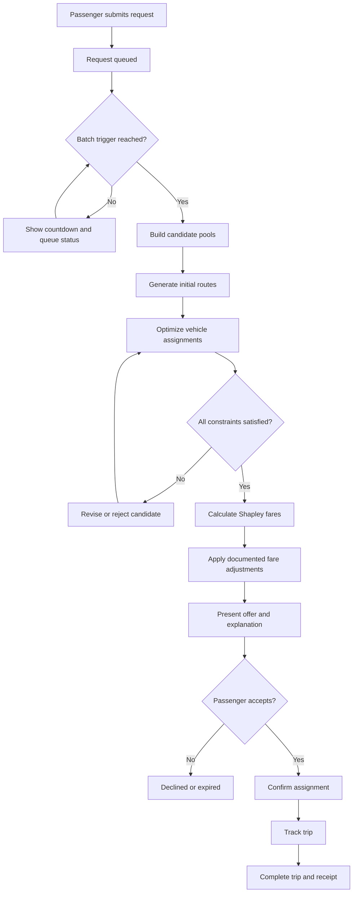

# RidePool AI — Complete App Flow & UI/UX Specification

> **Product:** RidePool AI  
> **Purpose:** Algorithmic ride-pooling, dynamic request batching, detour-constrained route optimization, and explainable Shapley-based fare allocation.  
> **Document type:** UI/UX structure, application flow, screen specification, and frontend/backend integration blueprint.  
> **Status:** MVP design specification. Any sample metrics or prices in this document are illustrative, not measured results.

---

## 1. Product Overview

RidePool AI is a ride-pooling application designed to group compatible passenger requests, optimize vehicle assignments and stop order, enforce a maximum passenger detour of **15%**, and explain each passenger's fare through a Shapley-value allocation engine.

The MVP should demonstrate two connected experiences:

1. **Passenger experience:** create a ride request, wait for matching, inspect a proposed shared ride and its fare, confirm the offer, track the simulated trip, and review the final fare.
2. **Operations dashboard:** generate or inspect demand, manage request batches, optimize routes, validate detour guarantees, inspect Shapley calculations, and benchmark the optimized approach against a basic baseline.

The algorithmic engine is the product's core differentiator. The interface should make its decisions understandable and auditable.

## 2. Product Design Principles

- **Promise before dispatch:** never label a route as feasible or guaranteed until the backend has validated every passenger's detour constraint.
- **Explain the decision:** expose why a request was matched, rejected, or left unmatched.
- **Transparent fares:** distinguish raw Shapley shares from adjusted payable fares.
- **Honest simulation:** clearly label synthetic, estimated, and observed values.
- **Useful failure states:** explain when no feasible pool exists rather than silently violating constraints.
- **Progressive complexity:** keep the passenger journey simple and place algorithmic detail in the operations dashboard.
- **Responsive design:** support a mobile-friendly passenger interface and a desktop-first operations console.
- **Single source of truth:** route feasibility, fare calculations, and optimization decisions come from the backend.

---

## 3. Application Information Architecture

### 3.1 Main entry points

- **Passenger Demo**
- **Operations Dashboard**

For a hackathon demo, both can run without real user accounts or payment processing. The operations dashboard should support a complete simulation using synthetic requests.

### 3.2 System architecture at a glance

```text
                    RIDEPOOL AI
                         |
             +-----------+-----------+
             |                       |
      Passenger App           Operations Dashboard
             |                       |
             +-----------+-----------+
                         |
                 RidePool AI API
                         |
     +-------------------+--------------------+
     |                   |                    |
 Batch Engine      Route Optimizer      Fair-Fare Engine
     |                   |                    |
     +------------ Detour Validator ---------+
                         |
                 Data & Infrastructure
                         |
      FastAPI · OR-Tools · OSRM · WebSockets
      React/Vite/TypeScript · Leaflet/OSM
```

### 3.3 Recommended technology stack

| Layer | Suggested technology | Responsibility |
|---|---|---|
| Frontend | React + Vite + TypeScript | Passenger UI and operations dashboard |
| Mapping | Leaflet + OpenStreetMap | Map, stops, routes, and vehicle markers |
| Backend | Python + FastAPI | Request, batch, optimization, and fare APIs |
| Route optimization | Google OR-Tools | Vehicle assignment and pickup/drop-off ordering |
| Travel-time estimates | OSRM or a replaceable routing provider | Consistent road-network distance and time estimates |
| Fare allocation | Python exact Shapley implementation for small coalitions | Explainable fair-fare calculation |
| Live updates | WebSockets | Batch state, vehicle position, and trip status |
| Initial storage | In-memory state for the demo | Simplify the first end-to-end prototype |
| Optional persistence | PostgreSQL/PostGIS | Persist trips, requests, routes, and geospatial data |
| Tests | pytest and frontend tests | Verify constraints and UI behavior |

The external routing service may have rate limits or availability issues. Cache results and prepare a fallback or prerecorded scenario for demos.

---

## 4. Complete End-to-End App Flow

### 4.1 Passenger journey

1. **Open the application**
   - The user enters the Passenger Demo.
   - In simulation mode, no account is required.
   - The home screen presents pickup and destination inputs.

2. **Enter pickup and destination**
   - Search for locations or select them on the map.
   - Select party size.
   - Calculate the solo reference route, estimated travel time, distance, and reference fare.

3. **Submit a ride request**
   - Create a request with pickup, destination, request timestamp, party size, and supported constraints.
   - Display the request as `Pending` or `Waiting for a pool`.

4. **Wait for batching**
   - Add the request to the current rolling batch.
   - Show the batch countdown, such as 15 seconds.
   - If configured, trigger the batch early when a request-count threshold is reached.

5. **Find compatible requests**
   - Filter requests by route overlap, capacity, and travel-time feasibility.
   - Do not imply that compatibility filtering alone guarantees a valid route.

6. **Optimize routes**
   - Generate an initial route with greedy insertion.
   - Use OR-Tools to improve vehicle assignment and pickup/drop-off ordering.
   - Respect vehicle capacity and pickup-before-drop-off precedence.

7. **Validate the detour promise**
   - Estimate pooled travel time for every passenger.
   - Compare each passenger's pooled travel time with their solo baseline.
   - Reject or revise any candidate that violates the 15% cap.

8. **Calculate fares**
   - Calculate exact Shapley values for the supported small coalition size.
   - Apply any documented fare caps or adjustments.
   - Reconcile the final payable fares with the fare-recovery policy.

9. **Present a ride offer**
   - Show the proposed route, stops, estimated arrival, detour, solo reference fare, pooled fare, and explanation.
   - Make it clear that the route is an estimate if real-time traffic data is not integrated.

10. **Accept or decline**
    - The passenger confirms or declines the offer.
    - The simulation should update the request lifecycle accordingly.

11. **Track the trip**
    - Animate the vehicle along the planned route.
    - Display upcoming pickups/drop-offs, ETA, and detour status.
    - Distinguish planned route segments from completed segments.

12. **Complete and review**
    - Show the completed route, final simulated travel time, final fare breakdown, and savings against the solo reference.
    - Store the result in simulation history.

### 4.2 System/algorithm flow



**Important:** implement a bounded optimization/retry policy so an infeasible candidate cannot cause an infinite loop. If no valid route is found, return a clear `No feasible match` result.

---

## 5. Passenger UI/UX Specification

### P1. Home & Route Planning

**Purpose:** let a passenger request a ride quickly.

**Layout**
- Map as the primary visual.
- Pickup and destination search fields in a bottom sheet on mobile.
- Current-location control.
- Party-size selector.
- Solo reference distance, time, and fare.
- Primary CTA: **Find a shared ride**.

**Interactions**
- Select or search pickup.
- Select or search destination.
- Change party size.
- Preview solo route and reference estimate.
- Submit request.

**States**
- Empty form
- Searching for a location
- Route estimate loading
- Route estimate available
- Invalid or unavailable location
- Request submission error

**UX guidance:** do not require the user to understand batching or optimization to request a ride.

### P2. Finding a Pool

**Purpose:** show that the system is actively processing the request.

**Components**
- Batch countdown
- Request status
- Progress steps:
  1. Request received
  2. Matching
  3. Route validation
  4. Fare calculation
- Cancel request action
- Short explanation of why matching can take time

**UX guidance:** replace an indefinite spinner with actual batch and solver state. In a demo, label generated progress events as simulated.

### P3. Pool Offer & Fare Breakdown

**Purpose:** help the passenger decide whether to accept the proposed ride.

**Components**
- Route preview and shared stops
- Pickup and drop-off estimates
- Estimated detour percentage
- Status confirming whether the estimate is within the 15% cap
- Solo reference fare
- Pooled fare
- Estimated savings in currency and percentage
- Expandable **Why this fare?** explanation
- Primary CTA: **Confirm ride**
- Secondary CTA: **Decline**

**UX guidance**
- Do not show a route as guaranteed until backend validation succeeds.
- If the route is only an estimate, say so.
- Display raw Shapley share and adjusted payable fare separately if adjustments are applied.
- State how long the offer remains valid if offer expiry is implemented.

### P4. Live Trip Tracking

**Purpose:** show where the simulated vehicle is and what happens next.

**Components**
- Vehicle marker and planned route
- Completed and remaining route segments
- Upcoming pickup/drop-off stops
- Estimated arrival time
- Trip status
- Detour meter against the 15% limit
- Accepted fare quote or fare ceiling

**UX guidance:** do not present simulated vehicle positions as real GPS telemetry.

### P5. Trip Summary

**Purpose:** close the journey with transparent results.

**Components**
- Completed route
- Total travel time and distance
- Final fare vs solo reference fare
- Estimated savings
- Final detour percentage
- Fare calculation details
- Trip history entry

If actual route telemetry is unavailable, label the results as simulated rather than observed.

### Suggested passenger navigation

| Navigation item | Purpose |
|---|---|
| Home | Plan a ride |
| My Ride | View current request or active trip |
| Trips | View completed and prior simulated trips |
| Profile | Optional preferences and account details |

For the MVP, profile and persistent trip history are secondary to the main request-to-offer-to-trip flow.

---

## 6. Operations Dashboard UI/UX Specification

The operations dashboard is the most important hackathon presentation surface. It should expose the algorithm's decisions and demonstrate the detour check, fare calculation, and baseline comparison.

### 6.1 Global dashboard layout

**Desktop**
- Persistent left sidebar
- Top bar with simulation status and controls
- KPI row
- Main map
- Request/batch panel
- Selected vehicle/passenger detail panel
- Lower panels for detour validation, fare explanation, and analytics

**Tablet/mobile**
- Collapsible navigation drawer
- Map-first view
- Detail panels as stacked cards or bottom sheets
- Tables become compact cards with clear labels

### 6.2 Overview Dashboard (O1)

**Purpose:** show the simulation's overall health.

**Components**
- Incoming requests
- Active vehicles
- Requests waiting in the current batch
- Batch countdown
- Active trips
- Feasible assignments
- Detour violations
- Solver status and runtime
- Live route map
- Recent system events

**Actions**
- Start simulation
- Pause simulation
- Reset simulation
- Run next batch
- Open a request, vehicle, or assignment

**Data integrity:** all KPIs must come from the current simulation state. Placeholder values must be visibly labelled as illustrative.

### 6.3 Live Map (O2)

**Map layers**
- Vehicle positions
- Pickup markers
- Drop-off markers
- Planned routes
- Completed route segments
- Selected passenger's route
- Rejected candidate route, when useful for explaining infeasibility

**Interactions**
- Click a vehicle to inspect capacity, route, and stop sequence.
- Click a request to inspect status, solo estimate, and assignment.
- Toggle route visibility by vehicle.
- Zoom to selected passenger or vehicle.

**Legend**
- Green: validated route
- Amber: pending request or work in progress
- Red: rejected candidate or actual constraint violation

Use labels/icons in addition to color so the status remains understandable to users with color-vision deficiencies.

### 6.4 Request & Batch Manager (O3)

**Components**
- Incoming request queue
- Request ID
- Pickup and destination
- Request timestamp
- Party size
- Solo travel-time estimate
- Current lifecycle status
- Current batch membership
- Batch timer and configured trigger

**Actions**
- Add a synthetic request
- Trigger a batch manually for demo purposes
- Inspect candidate compatibility
- Filter by request status
- Inspect why a request is unmatched

**States**
- Waiting for batch
- Batch processing
- Batch completed
- Request unmatched
- Request cancelled
- Processing error

Manual batch triggers should be clearly marked as demo/operator controls.

### 6.5 Route Optimization (O4)

**Components**
- Vehicle assignment list
- Ordered pickup/drop-off stops
- Route distance and travel-time estimate
- Vehicle capacity usage
- Solver status
- Solver runtime
- Candidate route comparisons
- Constraint outcomes

**Actions**
- Run optimizer
- Compare the initial greedy route with the optimized route
- Inspect stop order
- Inspect rejected candidates and reasons
- Re-run optimization when the scenario changes

**UX guidance:** show why a candidate was rejected—for example, capacity overflow, pickup/drop-off precedence violation, or detour over 15%.

### 6.6 Detour Guarantees (O5)

This is a key trust and verification screen.

**Per-passenger fields**
- Passenger/request ID
- Solo travel time
- Pooled travel-time estimate
- Absolute added time
- Detour percentage
- Limit
- Feasibility status
- Reason for rejection, if applicable

Use the formula:

\[
\text{Detour}_i =
\frac{T_i^{pooled}-T_i^{solo}}{T_i^{solo}}\times100\%
\]

A route is eligible for dispatch only when every passenger meets the defined detour limit and all other hard constraints pass.

**UX guidance**
- Make the time metric explicit; use in-vehicle travel time consistently for the MVP.
- Ensure solo and pooled estimates use the same routing assumptions.
- Display a clear no-match state when no valid route exists.
- Do not hide rejected candidates from the debugging/verification view.

### 6.7 Fair Fare Engine (O6)

**Purpose:** make fare allocation explainable and auditable.

**Summary fields**
- Coalition/passenger group
- Coalition route cost
- Raw Shapley share per passenger
- Solo reference fare
- Adjusted payable fare
- Fare cap status
- Reconciliation status

**Expandable explanation**
1. Coalition evaluated
2. Route cost \(v(S)\)
3. Passenger's marginal contribution
4. Average marginal contribution across orderings
5. Raw Shapley share
6. Cap or redistribution adjustment
7. Final payable fare

**Accounting rules**
- Define the coalition cost function consistently.
- The raw Shapley shares must sum to the full coalition route cost.
- If a share is capped at a solo fare and excess is redistributed, report the adjusted shares separately because the adjustment changes the raw Shapley allocation.
- Reconcile final fares to the chosen fare-recovery target and disclose any difference.
- For a small coalition, exact Shapley calculation is practical. A vehicle capacity of four means at most 24 passenger orderings to enumerate.

### 6.8 Benchmark & Analytics (O7)

**Purpose:** compare the proposed algorithm with a simple baseline.

**Comparison modes**
- Optimized algorithm
- Greedy/nearest-vehicle baseline

**Metrics**
- Request service rate
- Number of served and unmatched requests
- Total vehicle-kilometres
- Mean detour
- 95th-percentile detour
- Number of detour violations
- Fare savings against solo reference
- Gini coefficient of savings, if implemented
- Solver runtime
- Routing API latency

**Benchmark rules**
- Run both methods with the same generated request set, random seed, fleet, capacity, and routing assumptions.
- Define how unmatched requests are treated in each metric.
- Separate routing latency from optimization runtime where possible.
- Label all results as simulated when using synthetic data.
- Do not claim city-scale performance based on a small prototype run.

### 6.9 Simulation Settings (O8)

**Configurable parameters**
- Number of vehicles
- Vehicle capacity
- Number of synthetic requests
- Batch window duration
- Optional request-count trigger
- Scenario/random seed
- Request generation interval
- Detour cap (default 15%; changing it should be an explicit experiment)
- Baseline algorithm
- Map area or predefined scenario

**Actions**
- Apply settings
- Start simulation
- Pause
- Reset
- Run one batch
- Export metrics, if implemented

Keep the initial defaults small and reproducible: one demo area, three vehicles, and roughly 10–30 synthetic passenger requests.

### 6.10 Recommended dashboard navigation

| Sidebar item | Purpose |
|---|---|
| Overview | Fleet, demand, and system summary |
| Live Map | Vehicles, requests, and routes |
| Request & Batch Manager | Queue and batch lifecycle |
| Route Optimization | Assignments and stop ordering |
| Detour Guarantees | Per-passenger feasibility |
| Fair Fare Engine | Shapley values and fare adjustments |
| Benchmark & Analytics | Baseline comparison and KPIs |
| Simulation Settings | Scenario configuration |

---

## 7. Wireframe Concept

```text
+-----------------------------------------------------------------------+
| RidePool AI      Simulation: RUNNING     [Pause] [Reset] [Next Batch] |
+------------------+----------------------------------------------------+
| SIDEBAR          | KPI CARDS                                          |
|                  | Requests | Vehicles | Feasible Pools | Violations  |
| Overview         +------------------------------------+---------------+
| Live Map         |                                    | BATCH / QUEUE |
| Batch Manager    |                                    | Countdown     |
| Optimization     |              LIVE MAP              | Requests      |
| Detour Checks    |       Vehicles + Route Layers      | Batch status  |
| Fair Fares       |                                    +---------------+
| Analytics        |                                    | SELECTED ITEM |
| Settings         +------------------------------------+---------------+
|                  | DETOUR VALIDATION | FARE BREAKDOWN | EVENT LOG      |
+------------------+----------------------------------------------------+
```

This is a structural wireframe, not a pixel-perfect design. Build the responsive layout and component hierarchy first, then refine spacing, typography, and visual polish.

---

## 8. Visual Design System

### 8.1 Passenger experience

- Green for confirmed savings and valid offers
- White/light surfaces with clear spacing
- Large pickup/destination controls
- Prominent route, ETA, and fare cards
- One primary CTA per screen

### 8.2 Operations dashboard

- Dark slate navigation
- Light data panels for readability
- Blue interactive controls
- Amber for pending/warning states
- Red for rejected candidates or actual constraint violations
- Compact tables, charts, and expandable technical explanations

### 8.3 Reusable UI components

- `AppHeader`
- `OperationsSidebar`
- `KpiCard`
- `SimulationControls`
- `BatchCountdown`
- `RequestQueue`
- `RequestStatusBadge`
- `VehicleStatusCard`
- `LiveRouteMap`
- `RouteStopList`
- `DetourMeter`
- `ConstraintResult`
- `FareBreakdownCard`
- `ShapleyExplanation`
- `AlgorithmComparison`
- `MetricChart`
- `EmptyState`
- `ErrorState`
- `LoadingState`
- `ConfirmationDialog`
- `EventLog`

### 8.4 Accessibility and interaction rules

- Never use color alone to communicate status.
- Provide text labels and accessible names for icon buttons.
- Support keyboard navigation for forms, tables, and dialogs.
- Maintain readable contrast and font sizes.
- Use consistent terminology across the passenger and operations experiences.
- Include loading, empty, error, success, and no-match states.
- Make destructive actions such as reset or cancellation confirmable.
- Avoid excessive animations; map animation should not obscure route information.

---

## 9. Request Lifecycle and UI State Model

Use a shared, explicit request status model:

| State | Meaning | UI behavior |
|---|---|---|
| `pending` | Request received and waiting for a batch | Show queue status/countdown |
| `matching` | Candidate shared rides are being evaluated | Show matching progress |
| `validating` | Candidate routes are being checked | Show constraint-validation status |
| `offer_ready` | Feasible route and fare quote are available | Display offer and explanation |
| `confirmed` | Passenger accepted the offer | Display assigned route |
| `in_progress` | Vehicle is following the assigned route | Show trip tracking |
| `completed` | Trip finished | Display trip summary and fare receipt |
| `declined` | Passenger declined the offer | Show declined status |
| `cancelled` | Request or trip cancelled under the implemented policy | Show cancellation status |
| `no_feasible_match` | No route currently satisfies required constraints | Explain reason and available next action |
| `error` | Technical failure prevented processing | Show actionable error and retry if safe |

Do not conflate `no_feasible_match` with `error`. One is a legitimate algorithmic outcome; the other is a system failure.

### Re-optimization rule

When re-optimizing an active trip:
- Freeze the completed route prefix.
- Preserve accepted fare quotes as price ceilings.
- Permit changes only if all affected riders remain within their promised limits and any other commitments remain valid.
- If no valid revision exists, keep the current feasible plan or report that no safe update was found.

---

## 10. Frontend Project Structure

Recommended React + Vite + TypeScript structure:

```text
src/
├── app/
│   ├── App.tsx
│   ├── router.tsx
│   └── providers/
├── layouts/
│   ├── PassengerLayout.tsx
│   └── OperationsLayout.tsx
├── pages/
│   ├── passenger/
│   │   ├── HomePage.tsx
│   │   ├── MatchingPage.tsx
│   │   ├── OfferPage.tsx
│   │   ├── TrackingPage.tsx
│   │   └── TripSummaryPage.tsx
│   └── operations/
│       ├── OverviewPage.tsx
│       ├── LiveMapPage.tsx
│       ├── BatchManagerPage.tsx
│       ├── OptimizationPage.tsx
│       ├── DetourPage.tsx
│       ├── FairFarePage.tsx
│       ├── AnalyticsPage.tsx
│       └── SettingsPage.tsx
├── components/
│   ├── map/
│   ├── requests/
│   ├── routes/
│   ├── fares/
│   ├── metrics/
│   └── ui/
├── features/
│   ├── ride-requests/
│   ├── batching/
│   ├── optimization/
│   ├── detour-validation/
│   ├── shapley-fares/
│   └── simulation/
├── hooks/
├── services/
│   ├── api.ts
│   └── websocket.ts
├── types/
└── utils/
```

**Architecture rule:** the frontend displays backend results; it must not independently decide whether a route satisfies the detour cap or recalculate final payable fares. Put these rules in the backend and return explicit outcomes to the UI.

---

## 11. Backend API Integration

Suggested endpoints:

| Endpoint | Method | UI usage |
|---|---|---|
| `/api/v1/requests` | `POST` | Submit a passenger request |
| `/api/v1/requests` | `GET` | Request queue and batch manager |
| `/api/v1/simulation/start` | `POST` | Start simulation |
| `/api/v1/simulation/stop` | `POST` | Stop/pause simulation |
| `/api/v1/vehicles` | `GET` | Fleet status and map markers |
| `/api/v1/assignments/{id}` | `GET` | Route and stop details |
| `/api/v1/fares/{request_id}` | `GET` | Shapley explanation and fare receipt |
| `/api/v1/metrics` | `GET` | Benchmark and analytics |
| `/ws/live` | WebSocket | Real-time request, batch, vehicle, and trip updates |

Additional endpoints may be added for:
- Running a specific optimization batch
- Fetching candidate routes and rejection reasons
- Updating simulation settings
- Resetting the simulation
- Exporting benchmark results

### Backend response requirements

Route/assignment responses should include:
- Assignment status
- Vehicle ID
- Ordered stops
- Estimated route distance and duration
- Passenger-specific solo and pooled time
- Passenger-specific detour percentage
- Feasibility status and reason
- Solver runtime where available

Fare responses should include:
- Solo reference fare
- Coalition cost
- Raw Shapley share
- Adjustments applied
- Final payable fare
- Reconciliation status
- Explanation data suitable for the UI

---

## 12. Core Algorithm Behavior Reflected in the UI

### 12.1 Dynamic batching

- Add each incoming request to a batch.
- Trigger processing when the configured time window expires or the optional request-count threshold is met.
- Display batch status and trigger reason.
- Avoid processing the same batch twice.

### 12.2 Compatibility and route optimization

- Filter obviously incompatible requests.
- Generate an initial route using greedy insertion.
- Refine assignments and stop order using OR-Tools.
- Respect capacity and pickup-before-drop-off precedence.
- Return feasible routes and meaningful rejection reasons.

### 12.3 Detour validation

For each passenger \(i\):

\[
\text{Detour}_i =
\frac{T_i^{pooled}-T_i^{solo}}{T_i^{solo}}\times100\%
\]

For the MVP, define \(T_i\) as estimated in-vehicle travel time and use consistent routing assumptions for solo and pooled journeys.

- Validate all passengers in a candidate route.
- Do not dispatch a candidate if any passenger exceeds the configured 15% cap.
- Handle zero, missing, or invalid solo travel-time estimates explicitly.
- Keep a record of rejected candidates for testing and the dashboard.

### 12.4 Shapley fare allocation

- Define a coalition cost function \(v(S)\), such as the minimum route cost for coalition \(S\).
- Keep the accounting cost function well-defined for every subset used by the Shapley calculation.
- Enforce the dispatch detour cap separately from the coalition accounting calculation.
- Calculate raw Shapley shares for small coalitions.
- If a share exceeds the solo fare, apply the documented cap/redistribution policy.
- Clearly separate raw Shapley shares from adjusted payable fares.
- Verify raw-share and final-fare reconciliation independently.

---

## 13. Error, Empty, and Edge States

Design these states before polishing the dashboard.

| Situation | Required UI response |
|---|---|
| No incoming requests | Explain that the queue is empty and offer to generate sample demand |
| Batch countdown active | Show remaining time and batch membership |
| No compatible requests | Explain that no compatible pool was found |
| Route exceeds 15% detour | Reject candidate and show the passenger(s) and reason |
| Vehicle capacity exceeded | Reject candidate and explain capacity constraint |
| Routing provider unavailable | Show a routing error and use a declared fallback only if configured |
| Solver times out | Report timeout; do not label an unverified route as feasible |
| Fare allocation fails reconciliation | Mark fare result invalid and block offer publication |
| WebSocket disconnects | Show stale/live connection status and attempt reconnection |
| Passenger declines | Update request status and apply the defined re-optimization policy |
| Simulation reset | Confirm reset and clear current simulation state |
| No feasible match | Explain the algorithmic outcome separately from technical failure |

---

## 14. Non-Functional UI Requirements

- **Responsiveness:** passenger flow works on mobile; operations dashboard works on desktop and tablet.
- **Clarity:** status and constraint outcomes are understandable without reading algorithm source code.
- **Performance:** target prompt UI feedback under local demo conditions; measure real latency rather than claiming it in advance.
- **Data consistency:** display state from backend responses and WebSocket events.
- **Reliability:** prevent duplicate request submission and duplicate batch processing.
- **Reproducibility:** use fixed seeds for synthetic benchmarks.
- **Accessibility:** keyboard support, contrast, semantic labels, and non-color status indicators.
- **Observability:** show solver status, routing errors, and event logs in the operations view.
- **Honest labeling:** distinguish estimates, synthetic data, and actual observations.

---

## 15. MVP Acceptance Checklist

### Passenger flow
- [ ] Passenger can select pickup and destination.
- [ ] Solo reference estimate is displayed when routing succeeds.
- [ ] Passenger can submit a request.
- [ ] Request lifecycle is visible.
- [ ] Passenger sees an offer only after feasibility validation.
- [ ] Fare breakdown distinguishes raw and adjusted values.
- [ ] Passenger can accept or decline.
- [ ] Simulated trip can be tracked and completed.

### Operations dashboard
- [ ] Synthetic requests can be generated reproducibly.
- [ ] Batch timer and optional size trigger work.
- [ ] Requests and vehicle routes appear on the map.
- [ ] Optimizer assigns valid pickup/drop-off sequences.
- [ ] Capacity and precedence constraints are checked.
- [ ] Every served passenger meets the 15% detour cap in tested scenarios.
- [ ] Rejected candidates have meaningful reasons.
- [ ] Shapley shares are reproducible.
- [ ] Fare reconciliation is checked.
- [ ] Optimized and baseline methods use the same demand seed.
- [ ] Dashboard clearly labels simulated metrics.

### Technical integration
- [ ] Frontend receives backend results through the API.
- [ ] Live events update the UI.
- [ ] Routing and solver failures are visible.
- [ ] Reset clears simulation state safely.
- [ ] Unit and integration tests cover constraints and fare allocation.

---

## 16. Suggested Build Order

### Phase 1 — Algorithmic foundation
1. Define the travel-time detour metric and fare cost function.
2. Create synthetic ride requests and a fixed-seed scenario.
3. Implement batch triggering.
4. Implement compatibility filtering and greedy insertion.
5. Integrate OR-Tools.
6. Add detour and capacity validation.

### Phase 2 — Fare engine and APIs
1. Implement exact Shapley values for small coalitions.
2. Implement fare caps/adjustments and reconciliation.
3. Define request, assignment, fare, and metrics response models.
4. Add FastAPI endpoints.
5. Add tests for edge cases.

### Phase 3 — Operations dashboard
1. Build the overview and simulation controls.
2. Build the request/batch manager.
3. Add the map and route layers.
4. Add route optimization and detour validation panels.
5. Add the fare explanation screen.
6. Add baseline comparison and metrics.

### Phase 4 — Passenger experience and polish
1. Build route planning.
2. Build matching status and offer screens.
3. Add fare transparency.
4. Add simulated trip tracking and trip summary.
5. Add error/empty states and responsive layouts.
6. Run a full end-to-end demo rehearsal.

---

## 17. Recommended Hackathon Demo Sequence

A compelling demonstration should show the algorithm working, not only the UI.

1. Open the Operations Dashboard.
2. Start a fixed-seed simulation with a small fleet and synthetic demand.
3. Show requests entering the rolling batch.
4. Let the batch timer expire or trigger a batch manually.
5. Show candidate matching and route optimization.
6. Open the detour panel and verify that every accepted passenger is within 15%.
7. Open a passenger's fare breakdown and explain the raw Shapley share and any adjustment.
8. Toggle between optimized routing and the baseline using the same request seed.
9. Compare served requests, vehicle distance, detour statistics, and runtime.
10. Open the Passenger Demo to show the offer, fare explanation, and simulated trip tracking.

Avoid presenting invented results. Run the benchmark and display its actual output, even if the result is modest.

---

## 18. Scope Boundaries

### In scope for the MVP
- Single demo area
- Synthetic requests
- Small fleet, such as three vehicles
- Rolling-window batching
- Route optimization
- Hard detour cap
- Exact Shapley values for small coalitions
- Explainable fare breakdown
- Live map and simulation dashboard
- Greedy baseline comparison

### Out of scope for the initial MVP
- Real money payments
- Production ride-hailing dispatch
- Driver verification and onboarding
- City-scale performance guarantees
- Production-grade demand prediction or reinforcement learning
- Native mobile application
- Real driver telemetry
- Large-scale distributed optimization

---

## 19. Final Product Recommendation

**Build the operations dashboard first.** It demonstrates the project's main innovation: dynamic batching, constrained route optimization, detour validation, and explainable Shapley fares.

Then build the passenger offer and tracking flow so the system feels like a complete product. A responsive web app is enough for the MVP; prioritize algorithm correctness, transparent explanations, reproducible benchmarks, and a polished end-to-end demo over production-only features.
